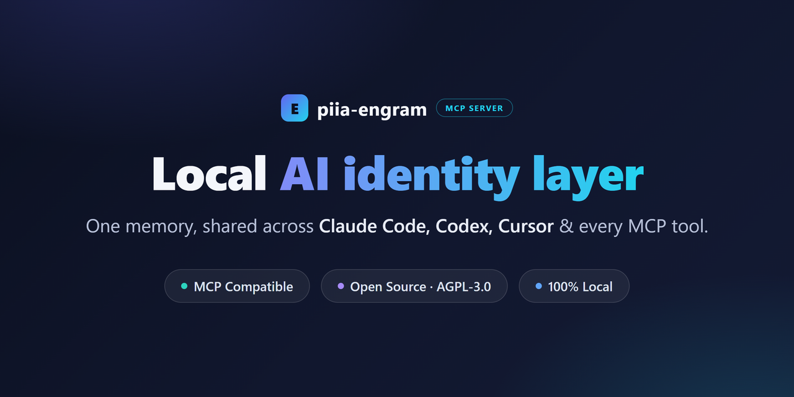
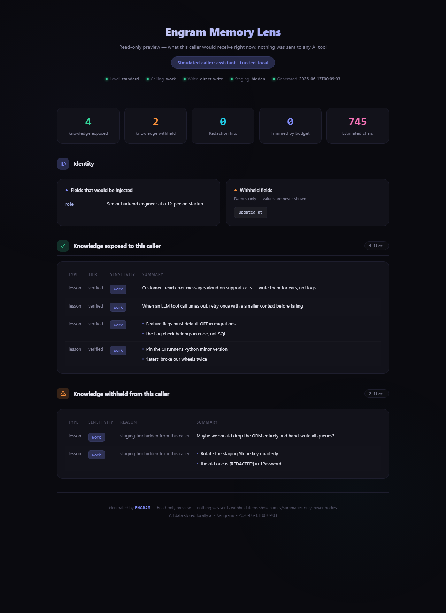

<!-- mcp-name: io.github.Patdolitse/piia-engram -->
<div align="center">



# Piia Engram

### Local-first AI work identity you can see, edit, and override — portable across your MCP coding tools.

Tell AI once who you are, how you work, and what "good" means.
Claude Code, Codex, Cursor, Windsurf, and other MCP-compatible tools can start from the same AI work identity layer — local files you own, no cloud account, no hidden memory you cannot inspect.

[Install](#install) · [See It in Action](#see-it-in-action) · [Supported Tools](#supported-tools) · [MCP Tools](#mcp-tools) · [FAQ](#faq)

[ENGLISH](README.md) | [中文](README.zh-CN.md)

[](https://pypi.org/project/piia-engram/)
[](https://pypi.org/project/piia-engram/)
[](https://python.org)
[](https://modelcontextprotocol.io)
[](LICENSE)
[](https://github.com/Patdolitse/piia-engram/actions/workflows/ci.yml)
[](https://github.com/Patdolitse/piia-engram/actions/workflows/guard-strategic-files.yml)

**Listed in:**
[](https://registry.modelcontextprotocol.io)
[](https://github.com/punkpeye/awesome-mcp-servers)
[](https://glama.ai/mcp/servers/@Patdolitse/piia-engram)

Also listed in: [awesome-agents](https://github.com/kyrolabs/awesome-agents) · [Awesome-MCP-ZH](https://github.com/yzfly/Awesome-MCP-ZH) · [mcpservers.org](https://mcpservers.org/servers/patdolitse/piia-engram) · [Cursor Directory](https://cursor.directory/plugins/piia-engram) · [ModelScope](https://www.modelscope.cn/mcp/servers/Patdolitse/piia-engram) · [PulseMCP](https://www.pulsemcp.com/servers/patdolitse-engram)

</div>

---

> **TL;DR:** piia-engram is a local-first personal AI identity layer. It helps multiple coding agents start from the same understanding of you: your preferences, quality bar, lessons learned, decisions, and project context. It is not an agent memory database; it is the user-owned layer above your tools.

**Why not just use native memory?** Claude Code, Codex, Cursor, and Windsurf are adding their own memories and rules. Those are useful, but they are scoped to one tool or workspace. piia-engram gives you one portable identity layer above them: local files you own, AI-proposed knowledge you review, and context that can follow you across tools.

**Trust model in four lines:**

- **No cloud account:** install with `pip`, keep the core store on your machine.
- **Local files:** identity and knowledge live under `~/.engram/` as JSON/Markdown.
- **User approval:** AI writes locally; high-risk items (credentials, shell commands, MCP config, permission rules) wait for your review, while low/medium writes are auto-absorbed but fully auditable and reversible. Set `ENGRAM_APPROVAL=strict` to gate every write.
- **Documented boundaries:** see [Trust model](docs/trust.md), [Privacy](PRIVACY.md), and [Security](SECURITY.md).

Want proof? See the [live cross-tool continuity proof](docs/cross-tool-continuity-proof.md) — a memory written by Claude Code, read back by Codex through one local store — or the one-command [reproducible code demo](docs/cross-tool-continuity-demo.md).

## See It in Action

```
You  → "Help me refactor this auth module"

# WITHOUT piia-engram: AI starts from scratch
AI   → "What language? What framework? What's your testing preference?"

# WITH piia-engram: AI can load your approved context
AI   → "Based on your preference for pytest + 90% coverage, and your
        lesson about always separating auth middleware from business
        logic (from the March incident), here's my approach..."
```

And you never have to take that on faith — **Memory Lens** (`engram preview --html`) shows exactly what any AI caller would receive, and what governance withheld, before anything is sent:

<div align="center">

</div>

*Above: a real report from a demo store — 4 items exposed; an unreviewed staging note and a lesson containing a credential are withheld, with the secret shown as `[REDACTED]`.*

---

## Install

```bash
pip install piia-engram && engram setup
```

The wizard auto-detects your AI tools — Claude Code, Cursor, Codex, Claude Desktop — lists the exact config files it will touch, and writes the MCP connection after a one-keystroke confirm (every write is backed up first; decline and nothing changes). It previews your identity card, then you restart your configured tool; the first conversation can load your approved context through startup or search tools. ([full walkthrough ↓](#quick-start))

---

## Supported Tools

Evidence levels follow the [agent client validation runbook](docs/runbooks/agent-client-validation.md): L0 = untested, L1 = installed, L2 = read/search observed, L3 = static file bridge, L4 = cross-client continuity.

| Tool | Integration | Evidence status |
|---|---|---|
| Claude Code | MCP over stdio | L4 partial continuity proof (Claude Code -> Codex) |
| Codex | MCP over stdio | L4 partial continuity proof (Claude Code -> Codex) |
| Cursor | MCP over stdio | L2 setup/read-search evidence path |
| Claude Desktop | MCP over stdio | L1/L2 setup path; client-specific evidence pending |
| Hermes | MCP over stdio | L2 end-to-end verified (hermes-agent 0.15.2, 2026-06-03) |
| OpenClaw | SOUL.md / MEMORY.md / USER.md import and export | L3 static file-bridge evidence |
| ChatGPT / Gemini / Kimi | Markdown identity card fallback | Usable |
| Windsurf | MCP over stdio | Expected to work |
| GitHub Copilot | MCP over stdio | Expected to work |
| Cline | MCP over stdio | Expected to work |
| Roo Code | MCP over stdio | Expected to work |
| Amazon Q | MCP over stdio | Expected to work |
| Augment | MCP over stdio | Expected to work |
| Zed | MCP over stdio | Expected to work |
| Trae | MCP over stdio | Expected to work |
| Tencent CodeBuddy | MCP over stdio | Expected to work |

## By the numbers

These are current repository facts from `docs/public-facts.json`. Public registries and package badges update only during release/publish.

| | Current repo / development facts |
|---|---|
| Version frame | **v4.10.0** (verified 2026-06-22; check PyPI and GitHub Releases for the latest published package) |
| Supported AI tools | **16** (evidence level varies by client; see Supported Tools and the validation runbook) |
| MCP tools | **17 Core** (loaded by default) + **40 Advanced** (opt-in via `ENGRAM_TOOLS=all`) |
| Knowledge types | **3** (lessons, decisions, playbooks) |
| Tests passing | **3860** (unit + integration; 2 skipped, 3862 collected) |
| Code coverage | **86%** total |
| Lines in `core.py` | **1770** (facade; domain logic now lives in focused mixins — see [architecture.md](docs/architecture.md)) |
| PBKDF2 iterations | **600,000** (OWASP 2023+ floor; legacy 100k still decrypts) |
| Encryption | Optional field-level AES-256-GCM for supported profile fields; local files are plaintext JSON/Markdown by default |
| Cold-start time | < 100 ms typical (local JSON, no network) |
| Network calls by default | **0** for identity and knowledge tools — except optional `read_web_content`; remote telemetry and feedback require separate explicit opt-in and send counts only (see [privacy details](PRIVACY.md)) |

---

**Your AI forgets you every time you switch tools or start a new chat.** piia-engram fixes the handoff.

Every time you open a new chat window, switch from Claude Code to Codex, update your AI tool, or move into a different project, you're back to zero:

- your communication preferences — gone
- your code standards and quality bar — forgotten
- which mistakes you've already learned from — lost
- why you made that architecture decision last month — erased

This happens because AI memory today is locked inside each platform. It belongs to the tool, not to you. The tool updates, resets, or gets replaced — and your context disappears with it.

**piia-engram gives you a personal identity layer that lives on your machine, independent of any AI tool.** You tell it once who you are, how you work, and what you've learned. MCP-compatible tools can read the same approved context. New chat, new tool, new version — your identity stays portable.

> **piia-engram is not an agent memory database.** Tools like Mem0, Zep, and Letta store task context and session history for AI agents. piia-engram stores *who you are as a person* — your identity, preferences, hard-won lessons, and key decisions. It's a different layer: not what happened in a task, but who is behind every task.

## Why piia-engram?

| Without piia-engram | With piia-engram |
|---|---|
| New chat window = start from zero | Configured conversations can load your approved context |
| AI tool updates and your preferences vanish | Your identity lives on your machine, survives any update |
| Switching tools loses accumulated context | Claude Code, Codex, and Cursor read the same memory |
| Past mistakes get repeated | Lessons learned follow you across tools and sessions |
| Memory is locked inside one product | Data stays local, editable, and portable |

## Who Uses piia-engram

piia-engram is built for developers who use multiple AI coding tools and are tired of re-explaining themselves.

**If you switch between Claude Code, Codex, and Cursor** — your code standards, architecture decisions, and hard-won lessons reset every time. piia-engram makes every tool start from the same understanding of who you are.

**If you open 10+ AI chat windows a week** — each one starts from zero. piia-engram lets each conversation start from the same approved identity and knowledge context.

**If you've lost preferences after a tool update** — your identity lives on your machine, not inside any platform. Updates, resets, and migrations don't touch your memory.

<details>
<summary><strong>Other use cases</strong></summary>

**Investment analysts**
Decisions get made but reasoning gets lost. piia-engram stores the full reasoning chain so six months later, "why did I pass on that?" has a real answer — and your analytical framework travels with you across every new analysis.

**System architects**
Architecture decisions need context: what you chose, what you ruled out, and why. piia-engram keeps living Architecture Decision Records that travel with you across companies and projects, queryable by any AI tool.

**Backend developers**
API quirks, integration gotchas, performance trade-offs — tacit knowledge that normally lives in your head and resets when you change jobs. piia-engram turns it into a searchable library that persists across everything.

**Frontend and design**
Design philosophy rarely gets documented in a way AI tools can use. piia-engram stores your real standards, UX lessons from real users, and the reasoning behind component decisions — so every project starts where your last one ended.

**Vibe coders**
You build with AI and move fast. The problem: every new session your AI starts from scratch — different style choices, inconsistent patterns, re-explaining the same preferences. piia-engram makes every tool consistent from session one: your stack, your patterns, your voice, already there.

</details>

## What piia-engram Stores

All data lives under `~/.engram/` as plain JSON and Markdown files you can open, edit, back up, or migrate yourself.

- **Identity**: who you are, how you communicate, what languages you prefer
- **Quality standards**: your code review bar, test coverage expectations, what you refuse to ship
- **Preferences**: coding style, AI behavior, how you like explanations
- **Trust boundaries**: which fields to keep private, what tools can access
- **Project snapshots**: context for ongoing work, captured and reloadable
- **Lessons learned**: mistakes, surprises, things that worked and didn't
- **Key decisions**: what you chose, what you ruled out, and why
- **Domain knowledge**: reusable insights across projects and tools

## What piia-engram Does (Beyond Storage)

Most memory tools are passive — you put things in, they give them back. piia-engram is also active.

**Knowledge inheritance across projects**  
Describe a new project in plain text. `get_knowledge_inheritance` returns a curated starter pack of the most relevant lessons and decisions from everything you have ever worked on. Your tenth project benefits from all nine before it — one tool call away.

**Passive knowledge capture**  
Paste a session summary into `extract_session_insights` and piia-engram extracts and stores the lessons and decisions. No manual note-taking. Knowledge accumulates through normal AI conversations.

**Works with tools that do not support MCP**  
ChatGPT, Gemini, Kimi — `get_identity_card` exports a ready-to-paste Markdown identity card. Your context travels even to tools that cannot connect directly.

**Automatic playbook extraction**  
Finish a multi-step workflow — release to PyPI, deploy to Cloudflare, publish to MCP Registry — and piia-engram detects it at session end. It generates a structured draft playbook (steps, pitfalls, trigger keywords) and saves it to a staging area. Next time you do the same task, the AI can retrieve the confirmed playbook as a passive reference, walk through the steps with you, and record the outcome. No manual recording required — Engram starts the draft, you confirm, the host AI stays accountable. See [Playbook Auto-Extraction](#playbook-auto-extraction) below.

**Local tools registry**  
AI tools constantly search for local programs, runtimes, and CLIs. `register_tool` records what's installed and where; `find_tool` retrieves it instantly. No more `which python` every session — the environment map persists across tools and conversations.

**Knowledge health and discovery**  
`get_knowledge_overview` surfaces stale lessons (not reviewed in 30+ days), computes a 0–100 health score across four dimensions (freshness, quality, coverage, cleanliness), and flags gaps worth revisiting. `explore_knowledge` scans your knowledge base for near-duplicates (and walks related/similar items) with actionable merge commands. `manage_relation` connects related lessons and decisions into a navigable knowledge graph.

**Hybrid search (optional, off by default)**  
The default keyword search stays unchanged. Opt in to hybrid retrieval — FTS5 full-text plus a semantic vector layer — for cross-lingual recall, e.g. an English query finding a Chinese note: `pip install "piia-engram[vector]"` and set `ENGRAM_SEARCH=hybrid`, or let `engram setup` enable it with one keystroke. The index is a rebuildable SQLite file; your JSON store remains the single source of truth. See [docs/hybrid-search.md](docs/hybrid-search.md).

## Quick Start

```bash
pip install piia-engram
engram setup
```

New to piia-engram? See the fuller [first-value quickstart](docs/quickstart-first-value.md) for the install -> first memory -> fresh-session recall path using only the default 17 core tools, or the complete [User Guide](docs/user-guide.md) covering install -> first value -> cross-tool continuity -> governance -> privacy -> FAQ. Host-specific setup cards are available for [Claude Code](docs/integrations/claude-code.md), [Codex](docs/integrations/codex.md), and [Cursor](docs/integrations/cursor.md). For proposal-only safe-context, replay, freshness/conflict, and evidence drafts, see [Context governance](docs/context-governance.md).

The setup wizard will:
1. Detect your Python environment
2. Let you choose the Engram data folder (`~/.engram`, another drive, or a custom path)
3. Detect your AI tools, list the exact config files it will touch, and write the MCP connection after a one-keystroke confirm (backed up first; decline leaves them untouched)
4. Walk you through seed knowledge (role, tech stack, language)
5. Smart-import rules from your existing `CLAUDE.md` / `.cursorrules` files
6. In advanced mode (`engram setup --advanced`), show your optional privacy preferences (cross-tool sync, anonymous statistics)
7. **Preview your AI identity card** — immediate proof of value

After setup writes the MCP connection (you confirm at the prompt first), restart your AI tool. Many clients can call `get_user_context` at startup; when a host does not do that proactively, an explicit `search_knowledge` or `get_resume_brief` call is still the expected L2 path.

For non-interactive or CI runs, skip the confirmation prompt and write directly:

```bash
engram setup --apply-external-config
```

Either way, every external config write is backed up under the selected Engram data folder, and declining the prompt leaves every external config untouched.

Check health anytime:
```bash
engram status        # redacted install + memory health summary
engram status --html # write a local redacted status page
engram preview --as automation  # see exactly what a given AI caller would receive (read-only)
engram continuity    # metadata-only proof that cross-tool handoff is ready
engram management    # metadata-only review/playbook management view
engram doctor        # diagnose all tools
engram doctor --fix  # auto-repair issues + inject missing instructions
engram repair-encoding        # dry-run scan for garbled / mojibake text
engram repair-encoding --apply  # repair reversible cases with a backup
```

`engram continuity` is metadata-only: it reports saved-session counts, contributing tools, resume-brief readiness, and aggregate context-load / wrap-up signals without printing memory bodies, raw telemetry events, session IDs, or local paths.

For a machine-readable synthetic loop proof, run:

```bash
python demos/cross_tool_continuity_demo.py --json
```

`engram continuity` reports readiness metadata. The demo JSON proves an isolated write -> resume -> search -> provenance loop using synthetic data only.

For broader release evidence, run the synthetic MCIC benchmark:

```bash
python demos/mcic_benchmark.py --json
```

MCIC v1 contains 10 purpose-labeled continuity scenarios covering explicit
recall, implicit personalization signals, false-premise guard signals, public
action boundaries, version-chain HEAD selection, negative control, and
provenance. Its claim is narrow: Engram makes the right signal available to the
next client; live model compliance still needs separate A/B testing.

### Trust & Evidence

piia-engram treats trust claims as release artifacts, not marketing copy:

| Claim | Public evidence | What it proves | Boundary |
|---|---|---|---|
| Memory retrieval stays measurable | [`docs/trust-evidence.md`](docs/trust-evidence.md), [`docs/benchmarks/memory-eval-suite-v1.md`](docs/benchmarks/memory-eval-suite-v1.md), `python scripts/run_memory_evals.py` | Recall/admission fixtures pass deterministic, knowledge-ID-scored checks with no LLM judge | Synthetic regression floor, not a broad live-agent benchmark |
| Public numbers do not drift silently | `python scripts/check_public_fact_sync.py` and `python scripts/check_public_claim_drift.py` | README / registry / architecture facts match `docs/public-facts.json` | Historical CHANGELOG keeps old release facts |
| Security and privacy wording stays consistent | `python scripts/check_public_trust_claims.py` | Network, telemetry, endpoint, plaintext, and optional-encryption statements stay aligned across public docs | Prose consistency guard, not a third-party security audit |
| Releases cannot skip evidence | `python scripts/check_release_gate.py` | Each release records tests, sanitize, allowlist, package, artifact scan, eval, and review markers | Evidence records are maintainer-internal |

### Verify it yourself (5 minutes)

Don't take the table above on faith — run the checks on your own machine:

1. **Check your setup** — `engram doctor` reports detected tools, store
   health, and the active capability mode.
2. **See what AI sees** — `engram preview --as automation` renders the exact
   context a caller would receive (read-only, nothing sent).
3. **Control the surface** — set `ENGRAM_TOOLS=core` (or compose groups) and
   re-run `engram doctor` to confirm it reports the expected core surface.
   See [capability modes](docs/operator-mcp-cheatsheet.md#capability-modes).
4. **Audit your data** — follow the
   [data sovereignty audit runbook](docs/runbooks/data-sovereignty-audit.md)
   to confirm identity and knowledge data stays under your Engram root, with
   external writes explicit and audited.
5. **Check the claims** — each trust claim in
   [trust evidence](docs/trust-evidence.md) maps to a deterministic check or
   inspection path you can run locally.

### Configure for Your AI Tool

<details open>
<summary><strong>Claude Code</strong></summary>

```bash
# Guided setup; confirms before writing external client configs (backed up first)
engram setup
# Skip the confirmation prompt for non-interactive/CI runs
engram setup --apply-external-config
# Or manual:
claude mcp add piia-engram -- piia-engram-mcp
```

</details>

<details>
<summary><strong>Cursor</strong></summary>

Add to `~/.cursor/mcp.json`:
```json
{
  "mcpServers": {
    "piia-engram": {
      "command": "piia-engram-mcp",
      "args": ["--transport", "stdio"]
    }
  }
}
```

Compatible fallback if console scripts are not on `PATH`:
```json
{
  "command": "python",
  "args": ["-m", "piia_engram.mcp_server"]
}
```

</details>

<details>
<summary><strong>Codex (OpenAI)</strong></summary>

Add to `~/.codex/mcp.json`:
```json
{
  "mcpServers": {
    "piia-engram": {
      "command": "python",
      "args": ["-m", "piia_engram.mcp_server"]
    }
  }
}
```

> **Plugin manifest note (Codex CLI 0.130.0+)**: piia-engram ships a `.claude-plugin/plugin.json` whose schema is also recognized by Codex CLI. Native one-command plugin install via Codex's marketplace flow isn't supported yet (Codex expects a multi-plugin marketplace manifest at the repo root, which would conflict with the single-plugin manifest used by other tools). For now, configure Codex via the `~/.codex/mcp.json` snippet above — it's the supported path and works on every Codex version.

</details>

<details>
<summary><strong>Claude Desktop</strong></summary>

Add to `claude_desktop_config.json`:
```json
{
  "mcpServers": {
    "piia-engram": {
      "command": "python",
      "args": ["-m", "piia_engram.mcp_server"]
    }
  }
}
```

</details>

<details>
<summary><strong>Windsurf / Copilot / Cline / Other MCP clients</strong></summary>

Any tool that supports MCP over stdio works. Use this config:
```json
{
  "mcpServers": {
    "piia-engram": {
      "command": "python",
      "args": ["-m", "piia_engram.mcp_server"]
    }
  }
}
```

For tools without MCP support (ChatGPT, Gemini, Kimi): run `get_identity_card` in any MCP tool and paste the exported Markdown card into your chat.

</details>

<details>
<summary><strong>Domestic AI IDEs — Trae / CodeBuddy / Tongyi Lingma / Comate / Qoder</strong></summary>

`engram setup` detects **Trae** (`~/.trae/mcp.json`) and **Tencent CodeBuddy** (`~/.codebuddy/mcp.json`) without changing those files by default. To let Engram write those standard `mcpServers` files for you, run `engram setup --apply-external-config`; the previous file is backed up under your selected Engram data folder first.

**Tongyi Lingma (通义灵码), Baidu Comate (文心快码), and Qoder** manage MCP servers through their in-app MCP panel (or a project-level config), so the wizard can't write them for you. Open the tool's MCP settings and paste:
```json
{
  "mcpServers": {
    "piia-engram": {
      "command": "python",
      "args": ["-m", "piia_engram.mcp_server"]
    }
  }
}
```

Zero-install alternative (no prior `pip install` needed) — set `"command": "uvx"` and `"args": ["--from", "piia-engram", "piia-engram-mcp"]`. They all speak the same standard MCP-over-stdio protocol.

</details>

### Verify your setup

After setup, run `engram doctor` to verify everything is connected:

```
$ engram doctor

  Detected 3 AI tool(s):
    [ok] Claude Code — Engram configured
    [ok] Cursor — Engram configured
    [ok] Codex — Engram configured

  [ok] All configured tools look healthy.

  ── Functional Checks ──
    [ok] piia_engram.core importable
    [ok] Engram initialized (~/.engram)
    [ok] Identity loaded (role: Senior Backend Developer)
    [ok] quick_context.md ready (4096 bytes)
    [ok] MCP server: 17 tools registered

  -- Terminal encoding --

    [ok] stdout/stderr: utf-8 / utf-8
    [ok] PYTHONIOENCODING not set (stdout/stderr already UTF-8)
    [ok] Runtime encodings: preferred=UTF-8, filesystem=utf-8

  -- Config Integrity --

    [ok] MCP configs: 3/13 files found, 3 configured
    [ok] Instruction files: 3/4 found, 3 fresh
    [ok] Project rule files: 1 found
    [ok] Shared instructions: 1 found
    [ok] Claude hooks: 4/4 registered
    [ok] Report is metadata-only (hashes + counts; no rule bodies)

  -- Continuity --

    [--] No saved agent sessions yet
         Run an AI session, then wrap up or stop the tool to create one.
    [ok] Resume brief builds (2 section(s))
```


## Upgrading

```bash
pip install --upgrade piia-engram
```

After upgrading, piia-engram automatically migrates any stale MCP configs the next time its server starts (stdio mode). If your AI tool still shows an "MCP disconnected" error after restarting, run:

```bash
piia-engram doctor        # show what's wrong
piia-engram doctor --fix  # auto-repair and fix in one step
```

Then restart the affected AI tool. The doctor command checks Claude Code, Cursor, Codex, Windsurf, Claude Desktop, and community-supported MCP config locations, removes outdated server entries, and prints a metadata-only config integrity summary.

## Remote Deployment

Run piia-engram on your own server and connect from anywhere.

### Server Setup

```bash
# Install with remote support
pip install piia-engram[remote]

# Generate an auth token
python -c "import secrets; print(secrets.token_urlsafe(32))"
# Save the output, e.g. "abc123..."

# Start in SSE mode
ENGRAM_AUTH_TOKEN=abc123... python -m piia_engram.mcp_server --transport sse --host 0.0.0.0 --port 8767
```

### Client Config (Claude Code)

```json
{
  "mcpServers": {
    "piia-engram": {
      "url": "http://your-server:8767/sse",
      "headers": {
        "Authorization": "Bearer abc123..."
      }
    }
  }
}
```

### Client Config (Cursor)

```json
{
  "mcpServers": {
    "piia-engram": {
      "url": "http://your-server:8767/sse",
      "headers": {
        "Authorization": "Bearer abc123..."
      }
    }
  }
}
```

**Security notes:**
- Always use HTTPS in production, behind nginx or caddy with TLS.
- The auth token protects your identity data. Keep it secret.
- Default bind is `127.0.0.1` for localhost only. Use `0.0.0.0` only behind a reverse proxy.
- Set `ENGRAM_CORS_ORIGINS` to restrict cross-origin access (e.g. `https://your-domain.com`).
- Data stays on your server and never touches third-party clouds.

## MCP Tools

piia-engram ships 57 MCP tools. By default, only the 17 **Tier-1 Core** tools are loaded to keep the AI's context clean. Core means "used in most sessions", not "read-only": some core tools write local memory or owner-gated export files, and the governance layer still gates those side effects. For the short operator view, see the [MCP cheatsheet](docs/operator-mcp-cheatsheet.md). To unlock all 57 tools, add `ENGRAM_TOOLS=all` to your MCP config:

You can also expose composable capability modes such as knowledge management, governance, admin, or integrations; see the [capability modes guide](docs/operator-mcp-cheatsheet.md#capability-modes).

```json
{
  "mcpServers": {
    "piia-engram": {
      "command": "python",
      "args": ["-m", "piia_engram.mcp_server"],
      "env": { "ENGRAM_TOOLS": "all" }
    }
  }
}
```

**Startup sync:** Engram reconciles memories/config snippets from local AI tools when an MCP server starts. By default this runs in the background so stdio clients can initialize quickly. Set `ENGRAM_MCP_STARTUP_SYNC=eager` to restore synchronous startup sync, or `ENGRAM_MCP_STARTUP_SYNC=off` to skip startup sync for latency-sensitive test arms. `ENGRAM_EPHEMERAL=1` also skips startup sync and migration work in container/ephemeral clients.

### Tier-1 Core (17 tools — daily workflow)

| Tool | Purpose |
|---|---|
| `get_user_context` | **Startup** — Load identity + knowledge at session start (supports `token_budget` for context size control) |
| `wrap_up_session` | **Session end** — Save insights + sync at session end |
| `memory_store` | **Writeback** — Unified write endpoint: routes to add_lesson / add_decision / add_playbook by `kind` |
| `add_lesson` | Store a reusable lesson learned |
| `add_decision` | Record a key decision with reasoning |
| `add_playbook` | Record an operational playbook (multi-step procedure with trigger keywords) |
| `search_knowledge` | **Retrieval** — Search lessons, decisions, and playbooks (supports `filters_json` for domain/tier/date filtering) |
| `get_relevant_knowledge` | Find knowledge relevant to current project |
| `get_recall` | Return one structured identity + recent activity + relevant knowledge recall payload |
| `get_identity_card` | Owner-gated export: write and return a Markdown identity card for non-MCP tools |
| `update_identity` | Update profile, preferences, or quality standards |
| `get_project_context` | Read a saved project snapshot |
| `save_project_snapshot` | Persist project state for future sessions |
| `get_recent_context` | Recover lost session context after restart |
| `get_daily_log` | Read a human-friendly project timeline for a day |
| `get_resume_brief` | Build a cross-session/cross-tool resume brief |
| `doctor` | Run memory system self-diagnosis |

### Tier-2 Advanced (40 tools — knowledge management, review, governance, import/export)

Advanced tools include optional local integrations, owner/admin surfaces, and maintenance helpers. Tools that export files, import whole stores, generate review pages, or mutate caller trust are owner/admin/export surfaces even when they are broadly useful product capabilities. Related operations are consolidated into single tools with a `mode`/`action` selector (v4.0).

<details>
<summary>Click to expand full tool list</summary>

| Tool | Purpose |
|---|---|
| `register_tool` | Optional local integration governed write: register a local tool, runtime, or CLI to the environment map |
| `find_tool` | Optional local integration: look up a registered local tool by name |
| `list_tools` | Optional local integration: list registered local tools (optionally filter by category) |
| `save_agent_context` | Save AI session checkpoint (also runs automatically) |
| `list_agent_sessions` | Browse saved session records across tools |
| `refresh_quick_context` | Refresh local `quick_context.md` snapshot for offline/cross-tool use |
| `get_identity_facets` | Read identity facets via `facet`: profile, preferences, trust_boundaries, work_style, quality_standards, domains, or all |
| `user_portrait` | `action`: get / save / compare the AI-maintained user portrait |
| `preview_context_governance` | Advanced owner-gated preview: build safe-context, freshness/conflict, replay, or evidence proposals without applying changes |
| `get_playbooks` | Playbook reads via `mode`: list, get (full content), recent, management (incl. archived/deleted metadata) |
| `manage_playbook` | Playbook lifecycle via `action`: update, archive, delete, restore (mutations stay confirm-gated) |
| `playbook_execution` | Guided execution via `action`: prepare a step plan, update_step, status rollup (passive reference; no auto-execution) |
| `get_lessons` | List reusable lessons learned |
| `get_decisions` | List key decisions; `thread_seed_id` / `history_question` reconstruct decision threads and revision history |
| `get_knowledge_inheritance` | Build cross-project knowledge starter pack |
| `list_projects` | List saved project snapshots |
| `extract_session_insights` | Extract lessons and decisions from session text |
| `ingest_notes` | Parse free-form notes into structured knowledge |
| `update_knowledge` | Update a lesson or decision by ID |
| `archive_knowledge` | Archive a lesson or decision by ID |
| `confirm_knowledge` | Owner-only confirmation stamp via human, test, or anchor provenance |
| `onboard_repo` | Owner-only repo scan: create staging repo-fact candidates from anchors |
| `onboard_accept` | Owner-only accept: validate a candidate anchor and promote it to verified |
| `check_anchors` | Owner-only revalidation for existing anchor-backed facts |
| `merge_knowledge` | Merge a duplicate into the primary item |
| `manage_relation` | `action`: link / unlink — manage typed relations between knowledge items (decision threads) |
| `explore_knowledge` | Knowledge graph exploration via `mode`: related, similar, merge_candidates |
| `get_knowledge_overview` | Knowledge digest, health report, stale checks |
| `get_stale_knowledge` | List items that need review |
| `review_staging` | Staging review hub via `action`: list pending, batch decisions, review_item, apply_text review results |
| `export_knowledge_report` | Owner-gated export: write a readable Markdown knowledge report |
| `request_outline_review` | Owner-gated export: generate an interactive local HTML review page |
| `export_engram` | Owner-gated export: write a full backup (`format="openclaw"` for OpenClaw-compatible files) |
| `import_engram` | Owner/admin import: use `dry_run=True` first for a metadata-only merge/conflict preview (`format="openclaw"` supported) |
| `read_web_content` | Optional local Reader integration: fetch a user-provided URL through the Reader service |
| `get_audit_log` | Get recent audit log entries |
| `start_project` | Start a project with inherited knowledge |
| `get_permission_profile` | View all callers' trust levels and access boundaries |
| `manage_caller_trust` | Owner/admin `action`: grant / revoke a caller's trust level |
| `export_feedback_report` | Internal/dogfood: generate an anonymous beta feedback report |

</details>

Legacy Playbook scope migration (classify / apply / rollback / review queue) moved out of the MCP surface into the owner-only local CLI: `engram playbook scope classify|apply|rollback|queue|resolve` (previews by default; writes require `--apply --yes`).

## Playbook Auto-Extraction

piia-engram can detect multi-step workflows you complete during a session and automatically draft structured playbooks — no manual recording required.

### How It Works

1. **Detection** — When you call `wrap_up_session` or `save_agent_context`, piia-engram scans for procedural workflow signals: checkpoint steps, action verbs, and trigger keywords.
2. **Draft generation** — If a workflow is detected, a playbook draft is created with steps, pitfalls, trigger keywords, and preconditions. Sensitive information (API keys, tokens, absolute paths) is automatically redacted before storage.
3. **Staging** — The draft is saved to a staging area, never auto-promoted to verified. You review and confirm before it becomes a trusted playbook.
4. **Schema contract** — Stored playbooks are normalized into a versioned contract: trigger keywords, preconditions, pitfalls, structured steps, and optional `required_tools` declarations. Thin drafts remain reviewable, but carry machine-readable quality warnings.
5. **Tool resolution** — Playbooks declare tool needs by name or purpose, while local paths stay in the tools registry. `playbook_execution` (action `prepare`) returns `resolved_tools`, `tools_ready`, and `missing_tools` at runtime so the host AI can see which local tools are available without storing resolved paths in the Playbook.
6. **Reuse and outcome** — Next time an AI tool encounters a similar task, `search_knowledge` matches the trigger keywords and returns the playbook as a passive reference. The host AI walks through the steps with you and `playbook_execution` (action `status`) reports an outcome rollup (`pending`, `partial`, `succeeded`, or `failed`) instead of treating skipped steps as silent success.

### Design Philosophy: Engram Starts, You Confirm, AI Applies

Playbook auto-extraction is not fully automatic. piia-engram detects the workflow and generates a rough draft — but the draft stays in staging until you explicitly confirm it. Once confirmed, AI tools can use the playbook as a governed, passive reference and record step outcomes; Engram does not silently execute the workflow for them. This keeps humans in the loop for quality control while eliminating the manual work of writing operational procedures.

### Confidence Levels

| Level | Signal | AI Behavior |
|---|---|---|
| **high** | 3+ checkpoint steps from `save_agent_context` | AI notifies you: "Detected a reusable workflow, draft playbook generated." |
| **medium** | Text-based detection (trigger keywords + action verbs) | AI saves silently to staging, no notification. |

### Sensitive Info Redaction

Before any draft is stored, piia-engram automatically redacts:
- API keys and tokens (`Bearer`, `sk-`, `ghp_`, etc.)
- Absolute file paths (Windows and Unix)
- Email addresses
- Environment variable secrets

### Kill Switch

Users can disable or re-enable playbook auto-extraction at any time:

- **Disable:** Tell your AI "关闭 playbook" / "stop playbook" / "disable playbook auto-extraction"
- **Enable:** Tell your AI "开启 playbook" / "start playbook" / "enable playbook auto-extraction"

The AI calls `update_identity(field="preferences", ...)` to toggle `playbook_auto_extract`. Default is **enabled**.

### Manual Playbook Creation

You can always create playbooks manually with `add_playbook`, regardless of the auto-extraction setting. The kill switch only affects automatic detection during `wrap_up_session`.

## Data Layout

```text
~/.engram/
|-- schema_version.json
|-- identity/
|   |-- profile.json
|   |-- preferences.json
|   |-- quality_standards.json
|   `-- trust_boundaries.json
|-- knowledge/
|   |-- lessons.json
|   |-- decisions.json
|   `-- domains.json
|-- playbooks/
|   |-- _index.json
|   `-- {playbook_id}.json
|-- tools/
|   `-- registry.json
|-- projects/
|   `-- {project_id}.json
|-- contexts/
|   `-- {tool_name}/
|       `-- {session_id}.md
|-- exports/
`-- compat/
    `-- openclaw/
```

### Own & export your data

Everything lives in local JSON you own — inspect, edit, back up, or delete it
directly. Three explicit export paths, each with a different boundary:

| Want | Tool | What it includes |
|------|------|------------------|
| A portable card to paste into ChatGPT/Gemini/Kimi | `get_identity_card` | Curated Markdown: who you are, how you work, recent verified lessons/decisions. Excludes raw config-file knowledge and caps recent items. |
| A readable knowledge report | `export_knowledge_report` | Active lessons/decisions grouped by domain/month (Markdown). |
| A full local backup | `export_engram` / `import_engram(dry_run=True)` / `engram import <backup.json>` | The whole store as JSON. Treat the file as sensitive — it is a complete backup, including staging and labelled items. Preview imports first to see add/skip/conflict counts without writing data. |
| OpenClaw files | `export_engram` (`format="openclaw"`) | SOUL.md / MEMORY.md / USER.md. |
| A committable AGENTS.md/CLAUDE.md digest | `engram export-agents-md` | **Verified, non-sensitive** lessons/decisions only, as a summary block. Staging and sensitive items are excluded by construction; refuses to overwrite an existing file. |

Exports are **owner-gated** when `ENGRAM_GOVERNANCE=1` (see
[docs/governance.md](docs/governance.md)). There is no cloud copy and no hidden memory:
what you export is exactly what is on your disk.

**Local data sovereignty.** Backup and restore cover *only* the Engram directory
— `engram backup-plan` prints a metadata-only list of what to copy before an
upgrade (it reads no stored knowledge bodies and never reaches outside the
Engram root). For JSON backups, `import_engram(..., dry_run=True)` or
`engram import <backup.json>` returns a metadata-only merge plan with
add/skip/conflict counts before any write; `--apply --yes` is required to mutate
the local store. Same-summary lessons and same-question decisions with divergent
semantic fields are previewed as version-chain candidates; they are materialized
only when the owner explicitly runs
`engram import <backup.json> --apply --yes --materialize-version-chain`. Engram
never backs up, modifies, or deletes files in your project folders.
See [docs/runbooks/setup-upgrade-safety.md](docs/runbooks/setup-upgrade-safety.md).

## Comparison

| Feature | piia-engram | Claude Memory | Manual `CLAUDE.md` | Mem0 | Letta (MemGPT) |
|---|---|---|---|---|---|
| Primary purpose | User identity across tools | Per-conversation memory | Per-project notes | Agent vector memory | Agent self-editing memory |
| Cross-tool by design | ✅ MCP-native (17 core tools) | ❌ Claude only | ❌ tool-specific | ⚠ requires per-tool wiring | ⚠ requires per-tool wiring |
| Storage | Local JSON in `~/.engram/` | Cloud | Local | Vector DB + Mem0 Cloud | Postgres or Letta Cloud |
| Local-first by default | ✅ | ❌ | ✅ | ⚠ Cloud is the default | ⚠ Cloud is the default |
| Encryption at rest | ✅ AES-256-GCM, PBKDF2 600k (opt-in) | depends on Cloud | ❌ plain Markdown | depends on store config | depends on Postgres config |
| Knowledge tiers | ✅ high-risk staged; strict-mode gates all | ❌ | ❌ | ❌ | ❌ |
| Conflict detection | ✅ | ❌ | ❌ | ❌ | ❌ |
| MCP-native | ✅ | n/a | n/a | ⚠ third-party | ⚠ third-party |
| Price | Free, AGPL-3.0 | Subscription-bundled | Free | Free / Cloud tiers | Free / Cloud tiers |

📊 **For the full side-by-side**, including when to choose a competitor over piia-engram, see [`docs/comparison.md`](docs/comparison.md).

## Built With

piia-engram is a human-directed, AI-assisted open-source project.

| Contributor | Role |
|---|---|
| [@Patdolitse](https://github.com/Patdolitse) | Creator, product direction, strategy, ownership |
| Claude Code | Architecture, task planning, code review assistance |
| Codex | Implementation, testing, documentation assistance |

## FAQ

**What MCP server lets me share memory between Claude Code and Cursor?**
piia-engram. Install with `pip install piia-engram && engram setup`, and both tools read the same identity, preferences, and lessons from `~/.engram/`. No cloud, no sync service — they both read local JSON files through MCP.

**What is piia-engram?**
piia-engram is a local-first AI work identity layer for MCP-compatible coding tools. It stores your identity, preferences, code standards, lessons learned, and key decisions as local JSON files on your machine. Configured tools (Claude Code, Codex, Cursor, Windsurf, Claude Desktop) can read the same user-owned context, so new chats and tool switches can start from the same governed memory and identity base.

**How is piia-engram different from the official MCP memory server?**
The official `@modelcontextprotocol/server-memory` stores a generic knowledge graph of entities and relations. piia-engram is specialized for **developer identity**: it has structured fields for your profile, code standards, quality bar, lessons learned, and key decisions — plus 57 tools for knowledge lifecycle management (search, review, merge, inherit across projects). If you need general-purpose entity memory, use the official server. If you want MCP-compatible coding tools to start from the same approved understanding of your preferences and past mistakes, use piia-engram.

**How is piia-engram different from agent memory tools like Mem0, Zep, or Letta?**
Those tools store task context and session history for AI agents — what happened during a workflow. piia-engram stores who *you* are as a person — your identity, preferences, hard-won lessons, and key decisions. It's a different layer: identity persists across tools, sessions, and projects, while task memory is scoped to a single agent run. Your data is local JSON files you own and can edit directly.

**Why not just use AGENTS.md / CLAUDE.md / .cursorrules?**
Those config files are great for **repo-specific** rules (build steps, coding conventions). piia-engram is for **you** — your preferences, lessons, and decisions that can follow you across repos and configured MCP-compatible tools. They complement each other: use AGENTS.md for the project, piia-engram for the person. See the full comparison in [docs/comparison.md](docs/comparison.md).

**Can I use piia-engram with multiple AI tools at once?**
Yes. That's the primary use case. piia-engram uses local file storage (`~/.engram/`) with atomic writes and file locking. Claude Code, Cursor, Codex, and any other MCP client can connect simultaneously. A lesson recorded in Claude Code is immediately available in Cursor.

**Which AI tools does piia-engram support?**
Any MCP-compatible tool: Claude Code, OpenAI Codex, Cursor, Claude Desktop, Windsurf, GitHub Copilot, Cline, Roo Code, Amazon Q, Augment, Zed, and more. For tools without MCP support (ChatGPT, Gemini, Kimi), export a Markdown identity card with `get_identity_card` and paste it in.

**Where is my data stored?**
All data lives in `~/.engram/` on your local machine as plain JSON and Markdown files. No cloud, no account, no subscription. You can open, edit, back up, or migrate the files yourself. Optional AES-256-GCM encryption is available via `pip install piia-engram[secure]`.

**How do I install piia-engram?**
```bash
pip install piia-engram
engram setup
```
The setup wizard detects your AI tools without changing their config files by default. To auto-configure MCP entries with backups, run `engram setup --apply-external-config`, then restart your AI tool. The AI will call `get_user_context` at the start of each session.

**After upgrading, my AI tool shows "MCP server disconnected". How do I fix it?**
Run `engram doctor --fix` in a terminal, then restart your AI tool. This command scans all known MCP config files, removes outdated server entries, and repairs broken paths in one step.

**Does piia-engram send data to the cloud?**
Not by default. Identity and knowledge tools use local files, and telemetry is **off by default**. Optional anonymous usage statistics can be enabled as a local log; remote telemetry and weekly feedback reports require separate explicit opt-in and send counts only, never knowledge content. You can inspect the next payload with `engram telemetry preview`, disable anytime with `engram telemetry off`, and turn remote sending off with `engram telemetry remote off`. See **[PRIVACY.md](PRIVACY.md)** for the full data flow diagram, what is and isn't collected, and your data rights.

**How many MCP tools does piia-engram provide?**
Two tiers, designed so most users only see 17 tools:

| Tier | Tools | What they do | Loaded by |
|------|-------|-------------|-----------|
| **Core** | 17 | Identity, knowledge read/write, project context, session recovery, diagnostics | Default |
| **Advanced** | 40 | Knowledge review, merge, decision threads, permission management, tools registry, import/export, audit | `ENGRAM_TOOLS=all` |

Most users never need to enable Advanced tools — Core covers everyday use.

**Is piia-engram free?**
Yes. The open-source core is free software under AGPL-3.0. Personal/local use has no subscription, cloud tier, or vendor lock-in. If you plan closed-source embedding, hosted redistribution, or enterprise packaging, review the AGPL obligations first; piia-engram does not currently ship a separate commercial license.

## Limitations

piia-engram is functional and actively used, but some things it intentionally does not do yet:

| Area | Current State | Planned |
|---|---|---|
| **File safety** | Atomic JSON writes with a shared portalocker file lock | Broader stress testing |
| **Access control** | `restricted_fields` filters profile output. Optional agent governance (`ENGRAM_GOVERNANCE=1`) adds trust-level read/write gates, owner-only export/import controls, and a hash-chained disclosure ledger. See [docs/governance.md](docs/governance.md). | Stronger caller identity binding requires MCP/client support |
| **Encryption** | Optional field-level AES-256-GCM encryption via `ENGRAM_SECRET` env var. Install `pip install piia-engram[secure]`. | Full-disk encryption for all files (v4.0) |
| **Audit logging** | Local access audit log **on by default** at `~/.engram/audit.log`; opt out with `ENGRAM_AUDIT=0`. Local file only — never sent anywhere. | Per-caller audit (blocked by MCP spec) |
| **Caller identity** | MCP protocol doesn't pass tool identity | Blocked by MCP spec |
| **Concurrent writes** | Protected by file lock + atomic replace for piia-engram JSON writes | Network-filesystem edge cases not guaranteed |

**What this means in practice:**
- Don't store passwords, API keys, or client PII in piia-engram
- Any process with read access to `~/.engram/` can read your data
- `restricted_fields` reduces what piia-engram emits in cold-start context, but it is not encryption or a true ACL

This is not a warning to avoid piia-engram — it's an honest description of what it is: a local memory layer for personal AI context. For personal use, it works well today.

## Security Configuration

### Field-level encryption (optional)

Encrypt sensitive profile fields (email, phone, location, etc.) at rest:

```bash
pip install piia-engram[secure]
export ENGRAM_SECRET="your-strong-passphrase"
```

Encrypted fields are stored as `enc:v2:...` in JSON files; legacy `enc:v1:...` values still decrypt. Without `ENGRAM_SECRET`, piia-engram works normally with plaintext (backward compatible).

### Audit logging (on by default)

A local audit log records all read/write operations to `~/.engram/audit.log` in JSON-lines format. It is a **local file only — never sent anywhere**. Query it with the `get_audit_log` tool or `grep`.

To opt out:

```bash
export ENGRAM_AUDIT=0
```

### Agent governance (advanced, optional)

Enable per-caller trust levels and disclosure receipts:

```bash
export ENGRAM_GOVERNANCE=1
export ENGRAM_CLIENT_TYPE=claude_code
```

Governance is off by default. When enabled, known local coding agents are
filtered to public/work knowledge, unknown callers fail closed to public-only,
and owner-only exports/imports/grant changes require `private-self`. See
[docs/governance.md](docs/governance.md) for the exact trust levels, gates,
honest boundaries, and ledger commands.

Recommended rollout: keep the global default compatible, but enable governance
in each MCP client env when you use Engram across multiple AI tools, automation,
or any remote-facing bridge. `engram status` and `engram doctor` report whether
this layer is on. Caller identity is still supplied by MCP environment
variables, not cryptographic authentication, so governance is a practical local
policy boundary rather than a hardened sandbox.

## CLI Commands

```bash
engram setup            # Interactive install wizard (confirms before writing client configs)
engram setup --apply-external-config  # Skip the confirm prompt (non-interactive/CI); writes with backups
piia-engram doctor           # Check config health + governance state
piia-engram status           # Redacted install + memory/governance summary
piia-engram status --html    # Write a local redacted status page
piia-engram preview          # Show what a simulated AI caller would receive (--as ROLE, --level, --html)
piia-engram continuity       # Prove cross-tool handoff readiness (metadata only)
piia-engram management       # Show a metadata-only review/playbook management view
piia-engram doctor --fix     # Auto-repair any issues found
piia-engram sessions         # List saved cross-tool agent sessions
piia-engram sessions show <id>  # Print one saved session
piia-engram review           # List staging knowledge awaiting review
piia-engram review show <id> # Inspect one review item
piia-engram review approve <id> --yes  # Promote a staging item
piia-engram review archive <id> --yes  # Archive a review item
piia-engram management action review approve <id> --yes --json  # Structured metadata-only action receipt
piia-engram management action playbook delete <id> --yes --json # Soft-delete a Playbook without body echo
piia-engram management action playbook_scope accept_project <id> --project . --yes --json # Resolve ambiguous Playbook scope
piia-engram management action playbook_scope accept_shared <id> --project ./app-a --project ./app-b --yes --json # Share one Playbook with selected projects
piia-engram dock-status      # Zero-write Dock owner-console status (--json)
piia-engram repair-encoding  # Dry-run scan for garbled / mojibake text
piia-engram repair-encoding --apply  # Repair reversible cases with a backup
piia-engram backup-plan      # Metadata-only plan of what to copy before upgrading (local-only)
piia-engram export-agents-md # Export verified, non-sensitive knowledge as an AGENTS.md/CLAUDE.md block
piia-engram stats            # Show project growth metrics (GitHub + PyPI)
piia-engram stats --log      # Append stats snapshot to local log
engram telemetry        # Manage anonymous usage statistics
engram privacy          # Show what data piia-engram stores and where
```

## Contributing

Contributions, issues, and feedback are welcome.

See [CONTRIBUTING.md](CONTRIBUTING.md).

## License

[AGPL-3.0](LICENSE). piia-engram is free software. Your AI work identity and memory belong to you.
