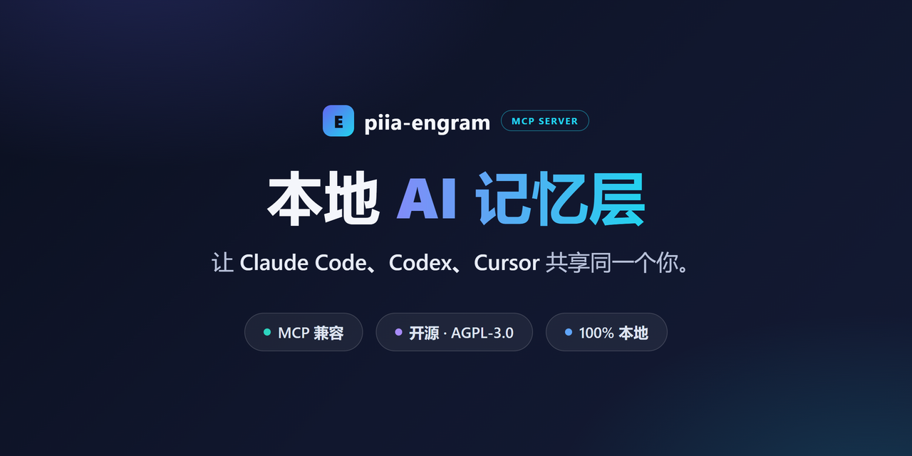
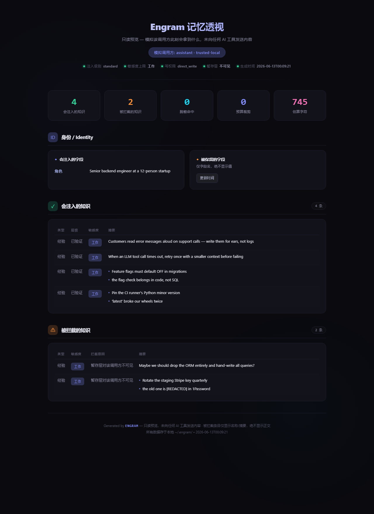

<!-- mcp-name: io.github.Patdolitse/piia-engram -->
<div align="center">



# Piia Engram

### 别再对每个 AI 工具重复介绍自己——本地优先的 AI 记忆，看得见、可改可删。

只告诉 AI 一次你是谁、怎么工作、什么算好。
Claude Code、Codex、Cursor、Windsurf 等 MCP 兼容工具可以从同一份已确认上下文开始——文件存在你本机，无云账号，没有你看不见的黑箱记忆。

[安装](#安装) · [效果预览](#效果预览) · [兼容工具](#兼容的-ai-工具) · [核心功能](#核心功能) · [常见问题](#常见问题-faq)

[中文](README.zh-CN.md) | [ENGLISH](README.md)

[](https://pypi.org/project/piia-engram/)
[](https://pypi.org/project/piia-engram/)
[](https://python.org)
[](https://modelcontextprotocol.io)
[](LICENSE)
[](https://github.com/Patdolitse/piia-engram/actions/workflows/ci.yml)
[](https://github.com/Patdolitse/piia-engram/actions/workflows/guard-strategic-files.yml)

**被收录于：**
[](https://registry.modelcontextprotocol.io)
[](https://github.com/yzfly/Awesome-MCP-ZH)
[](https://www.modelscope.cn/mcp/servers/Patdolitse/piia-engram)
[](https://github.com/punkpeye/awesome-mcp-servers)

[](https://glama.ai/mcp/servers/@Patdolitse/piia-engram)
[](https://lobehub.com/zh/mcp/patdolitse-piia-engram)

还收录于：[awesome-agents](https://github.com/kyrolabs/awesome-agents) · [mcpservers.org](https://mcpservers.org/servers/patdolitse/piia-engram) · [Cursor Directory](https://cursor.directory/plugins/piia-engram) · [PulseMCP](https://www.pulsemcp.com/servers/patdolitse-engram)

</div>

---

> **TL;DR：** piia-engram 是本地优先的个人 AI 身份层。它让多个 AI 编程工具从同一份"你"开始工作：你的偏好、质量标准、经验、决策和项目上下文。它不是 agent memory 数据库，而是用户拥有、可审查、可迁移的上层身份资产。

**为什么不用工具自带记忆就够了？** Claude Code、Codex、Cursor、Windsurf 都在加入自己的记忆和规则。这些能力有用，但通常只属于某一个工具或工作区。piia-engram 位于它们之上：一份你拥有的本地身份层——本地文件归你所有，AI 建议的知识你可随时查看与否决，高风险条目留待你审核，上下文可以跨工具延续。

**信任模型四句话：**

- **无云账号：** `pip` 安装，核心数据留在你的机器上。
- **本地文件：** 身份与知识保存在 `~/.engram/` 下的 JSON/Markdown 文件中。
- **用户确认：** AI 在本地写入；高风险条目（凭据、shell 命令、MCP 配置、权限规则）会留待你审核，低/中风险自动吸收但全程可审计、可回退。设 `ENGRAM_APPROVAL=strict` 可让所有写入都先送审。
- **边界公开：** 见 [信任模型](docs/trust.md)、[隐私说明](PRIVACY.md) 和 [安全说明](SECURITY.md)。

想看安全的公开演示？见 [跨工具接续 Demo](docs/cross-tool-continuity-demo.md)。

## 效果预览

```
你   → "帮我重构这个认证模块"

# 没有 piia-engram：AI 从零开始
AI   → "你用什么语言？什么框架？测试偏好是什么？"

# 有 piia-engram：AI 已经认识你
AI   → "根据你偏好 pytest + 90% 覆盖率的标准，以及你 3 月那次事故
        后总结的'认证中间件必须和业务逻辑分离'的经验，我的方案是..."
```

而且这不需要你"相信"——**记忆透视**（`engram preview --html`）让你在任何内容被发送之前，看到 AI 调用方会收到什么、治理拦下了什么：

<div align="center">

</div>

*上图：演示库的真实报告——4 条知识注入；一条未审核的暂存笔记和一条含密钥的经验被拦截，密钥显示为 `[REDACTED]`。*

---

## 安装

```bash
pip install piia-engram && engram setup
```

向导会自动检测你的 AI 工具——Claude Code、Cursor、Codex、Claude Desktop——列出将要修改的配置文件并请你一键确认后才写入 MCP 连接（每次写入前都会备份；选择"否"则一字不改），随后预览你的身份卡。重启已配置的工具后，新对话可以通过启动或搜索工具加载你已确认的上下文。（完整步骤见下方"快速开始"）

---

## 兼容的 AI 工具

证据等级遵循 [agent 客户端验证 runbook](docs/runbooks/agent-client-validation.md)：L0 = 未测试，L1 = 已安装，L2 = 读取/搜索已观察，L3 = 静态文件桥，L4 = 跨客户端连续性。

| 工具 | 接入方式 | 证据状态 |
|------|---------|--------|
| Claude Code | MCP (stdio) | L4 部分连续性证明（Claude Code -> Codex） |
| Codex | MCP (stdio) | L4 部分连续性证明（Claude Code -> Codex） |
| Cursor | MCP (stdio) | L2 setup / read-search 证据路径 |
| Claude Desktop | MCP (stdio) | L1/L2 setup 路径，客户端专项证据待补 |
| Hermes | MCP (stdio) | L2 端到端验证（hermes-agent 0.15.2，2026-06-03） |
| Windsurf | MCP (stdio) | 应兼容 |
| GitHub Copilot | MCP (stdio) | 应兼容 |
| Cline | MCP (stdio) | 应兼容 |
| Roo Code | MCP (stdio) | 应兼容 |
| Amazon Q | MCP (stdio) | 应兼容 |
| Augment | MCP (stdio) | 应兼容 |
| Zed | MCP (stdio) | 应兼容 |
| Trae | MCP (stdio) | 应兼容 |
| 腾讯 CodeBuddy | MCP (stdio) | 应兼容 |
| OpenClaw | SOUL.md/MEMORY.md 导入导出 | L3 静态文件桥证据 |
| ChatGPT / Kimi / Gemini | 粘贴身份卡 | 可用 |

## 量化数据

下列数字每个 minor release 都会刷新：

| | v4.0.0 (2026-06-11) |
|---|---|
| 支持 AI 工具 | **16** 个（不同客户端证据等级不同；见支持工具表和客户端验证 runbook）|
| MCP 工具 | **17 个核心**（默认加载）+ **36 个高级**（`ENGRAM_TOOLS=all` 开启）|
| 知识类型 | **3** 种（经验教训、关键决策、操作手册 Playbook）|
| 测试通过 | **3297** 个（单元 + 集成；2 个 skipped，共收集 3299）|
| 代码覆盖率 | **86%** 总体 |
| `core.py` 行数 | **1573** 行（facade，领域逻辑已拆分为专责 mixin —— 见 [架构文档](docs/architecture.md)）|
| PBKDF2 轮数 | **600,000**（符合 OWASP 2023+ 推荐；100k 旧密文仍可解密）|
| 加密 | 支持字段级 AES-256-GCM（可选）；本地文件默认是明文 JSON / Markdown |
| 冷启动延迟 | < 100 ms（本地 JSON，无网络）|
| 默认网络调用 | 身份与知识工具默认 **0** —— 除可选的 `read_web_content` 外；远程 telemetry 与反馈报告必须单独显式开启，且只发送计数（详见 [隐私说明](PRIVACY.md)）|

客户端专项 setup 卡： [Claude Code](docs/integrations/claude-code.md)、[Codex](docs/integrations/codex.md)、[Cursor](docs/integrations/cursor.md)。证据等级采用 [客户端验证 runbook](docs/runbooks/agent-client-validation.md)：L0/L1 表示安装或协议可达，L2 表示观察到读/搜索行为，L3 增加 A/B 行为收益，L4 增加跨客户端连续性，L5 表示可公开引用的可复现证据。

---

**每次换工具或开新对话，AI 就忘了你是谁。** piia-engram 解决的是跨工具接续问题。

每次开一个新对话框，你就被忘了。换个工具，又要从头自我介绍。工具一更新，之前设好的偏好可能直接没了。

这是因为现在所有 AI 的记忆都绑在各自的平台上。记忆属于平台，不属于你。平台改了、升了、换了，你的上下文就没了。

**piia-engram 给你一层跨工具的个人身份，存在你自己的电脑上。** 你告诉它一次你是谁、你怎么工作、你学到了什么。之后不管你开多少个新对话、用哪个 MCP 工具、工具怎么更新，它们都可以读取同一份已确认上下文。

> **piia-engram 不是 Agent 记忆数据库。** Mem0、Zep、Letta 等工具存的是任务上下文和会话历史。piia-engram 存的是**你这个人**——你的身份、偏好、经验教训和关键决策。这是不同的一层：不是"这次任务做了什么"，而是"所有任务背后的人是谁"。

## 它解决什么

| 没有 piia-engram | 有 piia-engram |
|------------|-----------|
| 新对话 = 从零开始 | 已配置的对话可加载已确认上下文 |
| 工具一更新，偏好可能没了 | 身份存在你电脑里，任何更新都不影响 |
| 换工具要重新自我介绍 | Claude Code、Codex、Cursor 共享同一套记忆 |
| 踩过的坑下次还会踩 | 经验教训跨工具、跨会话持续有效 |
| 记忆锁死在某个平台 | JSON 文件存本地，可读可编辑可迁移 |

## 谁在用 piia-engram

piia-engram 为同时使用多个 AI 编程工具、厌倦重复自我介绍的开发者而生。

**如果你在 Claude Code、Codex、Cursor 之间切换** — 代码标准、架构决策、踩过的坑，每次都要重讲。piia-engram 让每个工具从同一个起点认识你。

**如果你每周开 10+ 个 AI 对话框** — 每一个都从零开始。piia-engram 让已配置的对话可以从同一份已确认身份和知识上下文开始。

**如果你因为工具更新丢过偏好** — 你的身份存在自己电脑里，不在任何平台内部。更新、重置、迁移都不影响你的记忆。

<details>
<summary><strong>更多使用场景</strong></summary>

**投资分析师**
决策做了，但推理链丢了。piia-engram 存下每个决策的完整推理，六个月后"我当时为什么放弃那个机会"有真实答案。你的分析框架，不只是笔记，会跟着你进入每一次新分析。

**系统架构师**
架构决策需要上下文：选了什么、排除了什么、为什么。这些内容在 Wiki 里没人读，在记忆里会消失。piia-engram 保存活的架构决策记录，跨公司、跨项目可检索，AI 在你设计下一个系统时可以直接调用。

**后端开发者**
第三方 API 的坑、集成的隐患、性能权衡——这些隐性知识原本只活在你脑子里，换工作就归零。piia-engram 把它们变成可搜索的知识库，在新项目遇到同类问题时主动提醒你。

**前端与设计**
你的设计哲学、真实用户反馈带来的 UX 教训、组件选型背后的理由，很少能以 AI 工具能用的方式记录下来。piia-engram 把这些存成可供 AI 调用的知识，每个新项目都从上一个结束的地方继续。

**Vibe 编程用户**
你用 AI 快速构建，每次开新会话却要重头解释：你的技术栈、你的风格偏好、你不想要的写法。piia-engram 让每个工具从第一条消息就认识你——同样的栈、同样的模式、同样的语气，不用再重复自己。

</details>

## piia-engram 不只是存储

大多数记忆工具是被动的：你放进去，它给你取出来。piia-engram 还是主动的。

**跨项目知识继承**  
描述一个新项目，`get_knowledge_inheritance` 从你所有过往工作中自动提炼最相关的教训和决策，给你一份定制化的起步知识包。第十个项目从前九个的积累中受益——一个工具调用即可获取。

**被动知识捕获**  
把一次会话的摘要粘贴给 `extract_session_insights`，piia-engram 提取并存储其中的教训和决策。不需要手动记笔记，知识通过日常 AI 对话自然积累。

**不支持 MCP 的工具也能用**  
ChatGPT、Gemini、Kimi 没有 MCP 接口。`get_identity_card` 导出一张即粘即用的 Markdown 身份卡，你的 AI 上下文连不能直接连接的工具也能用上。

**自动流程提取**  
完成一个多步骤的操作流程——发布到 PyPI、部署到 Cloudflare、上架到 MCP Registry——piia-engram 在会话结束时自动检测。它生成结构化的 Playbook 草稿（步骤、踩坑记录、触发关键词），存入暂存区。下次遇到同样的任务，AI 可以把确认后的 Playbook 当作被动参考调出，逐步和你确认执行，并记录结果。无需手动记录——Engram 负责起草与治理，宿主 AI 对执行过程负责。详见下方 [Playbook 自动提取](#playbook-自动提取)。

**本地工具图谱**  
AI 工具总是在找本地的程序、运行时和 CLI。`register_tool` 记录已安装的工具和路径；`find_tool` 一步调取。不再每次都 `which python`——环境图谱跨工具、跨会话持久可用。

**知识健康与发现**  
`get_knowledge_overview` 找出久未复查的知识（30 天以上），计算 0–100 健康度评分（新鲜度、质量、覆盖度、清洁度四个维度），提示哪些内容值得重新确认。`explore_knowledge` 全库扫描近似重复条目（也可查关联/相似知识），返回可直接执行的合并命令。`manage_relation` 把相关教训和决策串联成可导航的知识网络。

**混合检索（可选，默认关闭）**  
默认关键词检索行为完全不变。按需开启混合检索——FTS5 全文检索 + 语义向量层——获得跨语言召回能力（例如用英文查询找到中文笔记）：`pip install "piia-engram[vector]"` 并设置 `ENGRAM_SEARCH=hybrid`，或在 `engram setup` 向导里一键开启。索引是可重建的 SQLite 文件，JSON 存储始终是唯一数据源。详见 [docs/hybrid-search.zh-CN.md](docs/hybrid-search.zh-CN.md)。

## 快速开始

```bash
pip install piia-engram
engram setup
```

第一次使用？可以先看更完整的 [首个价值快速上手](docs/quickstart-first-value.zh-CN.md)，按默认 17 个核心工具完成 install -> first memory -> fresh-session recall 这条最短路径；或看完整的 [用户指南](docs/user-guide.zh-CN.md)，覆盖 安装 -> 首个价值 -> 跨工具续接 -> 治理/审批 -> 隐私/数据主权 -> 常见问题。Safe Context、replay、freshness/conflict 和 evidence draft 这类 proposal-only 能力见 [Context governance](docs/context-governance.md)。

默认安装会选择 Engram 独立数据目录，检测到外部 AI 工具后**列出将要修改的具体配置文件路径并请你一键确认**，确认后才写入 Claude/Codex/Cursor/Zed 等客户端的 MCP 配置；选择"否"则一字不改，写入前都会在所选 Engram 数据目录下创建备份。非交互/CI 场景可用 `engram setup --apply-external-config` 跳过确认直接写入。

安装向导会自动完成：
1. 检测 Python 环境
2. 检测你的 AI 工具（Claude Code、Cursor、Claude Desktop、Codex），列出将要修改的配置文件并请你一键确认后才写入（写入前备份；选择"否"则一字不改）
3. **注入 AI 指令**到每个工具的原生配置（`CLAUDE.md`、`.cursorrules`、`AGENTS.md`），确保 AI 主动调用 Engram
4. 引导你录入种子知识（角色、技术栈、语言）
5. 智能导入你已有的 `CLAUDE.md` / `.cursorrules` 规则文件
6. 高级模式（`engram setup --advanced`）可设置隐私偏好（跨工具同步、匿名使用统计，均可选）
7. **预览你的 AI 身份卡**——安装即见效

如果 MCP 客户端已经配置好，setup 完成后重启 AI 工具即可。若还没有配置，请手动添加 MCP 条目，或运行下面显式授权的自动写入命令。第一次成功连接后的对话会自动调用 `get_user_context`——AI 已经认识你了。

随时检查健康状态：
```bash
engram status        # 脱敏安装与记忆健康摘要
engram status --html # 写出本地脱敏状态页
engram preview --as automation  # 看某类 AI 调用方此刻会拿到什么（只读，不发送）
engram continuity    # 仅用元数据证明跨工具接续已就绪
engram management    # 脱敏的审查 / Playbook 管理视图
engram doctor        # 诊断所有工具
engram doctor --fix  # 自动修复 + 注入缺失的 AI 指令
engram repair-encoding        # dry-run 扫描乱码 / mojibake
engram repair-encoding --apply  # 备份后修复可逆乱码
```

`engram continuity` 只报告接续就绪度元数据，不输出记忆正文、原始遥测、session id 或本地路径。

如果需要机器可读的合成链路证明，可以运行：

```bash
python demos/cross_tool_continuity_demo.py --json
```

区别是：`engram continuity` 证明当前存储具备接续条件；demo JSON 用合成数据证明 write -> resume -> search -> provenance 这条隔离链路真的能跑通。

如果要做更完整的发布证据，可以运行合成 MCIC 基准：

```bash
python demos/mcic_benchmark.py --json
```

MCIC v1 包含 10 个带测试目的的连续性场景，覆盖显式召回、隐式个性化信号、假前提防护信号、公开动作边界、版本链 HEAD 选择、负控和 provenance。它的主张很窄：Engram 让下一个客户端拿得到正确的信号；真实模型是否会照做仍需要单独 A/B 测试。

### 信任与证据

piia-engram 把可信声明当作发布证据，而不是营销文案：

| 声明 | 公开证据 | 证明什么 | 边界 |
|---|---|---|---|
| 记忆检索质量可衡量 | [`docs/trust-evidence.md`](docs/trust-evidence.md), [`docs/benchmarks/memory-eval-suite-v1.md`](docs/benchmarks/memory-eval-suite-v1.md), `python scripts/run_memory_evals.py` | Recall/admission fixtures 通过确定性、按知识 ID 打分的检查，不依赖 LLM judge | 合成回归底线，不是广泛 live-agent benchmark |
| 公开数字不会静默漂移 | `python scripts/check_public_fact_sync.py` 和 `python scripts/check_public_claim_drift.py` | README / registry / architecture 的公开事实与 `docs/public-facts.json` 一致 | CHANGELOG 保留历史版本事实 |
| 安全与隐私措辞保持一致 | `python scripts/check_public_trust_claims.py` | 网络、telemetry、endpoint、默认明文、可选加密等声明在公开文档中一致 | 文案一致性闸，不等同第三方安全审计 |
| 发布不能跳过证据 | `python scripts/check_release_gate.py` | 每个版本记录测试、脱敏、allowlist、构建、产物扫描、eval 和复核标记 | evidence 记录为维护者内部文件 |

### 自己验证（5 分钟）

不要只相信上面的表格，可以在自己的机器上运行这些检查：

1. **检查你的设置** — `engram doctor` 会报告检测到的工具、存储健康状态，以及当前能力模式（capability modes）。
2. **查看 AI 会看到什么** — 记忆透视（preview）命令 `engram preview --as automation` 会渲染调用方将收到的准确上下文（只读，不发送任何内容）。
3. **控制暴露面** — 设置 `ENGRAM_TOOLS=core`（或组合多个组），再运行 `engram doctor`，确认它报告预期的 core 暴露面。详见 [能力模式（capability modes）](docs/operator-mcp-cheatsheet.md#能力模式)。
4. **审计你的数据** — 按照 [数据主权审计 runbook](docs/runbooks/data-sovereignty-audit.md)，确认身份与知识数据都在你的 Engram 根目录下，外部写入均为显式且可审计。
5. **检查声明** — [信任证据](docs/trust-evidence.md) 中的每条信任声明，都映射到你可以在本地运行的确定性检查或检查路径。

### 验证安装

setup 完成后，运行 `engram doctor` 验证一切就绪：

```
$ engram doctor

  Detected 3 AI tool(s):
    [ok] Claude Code — Engram configured
    [ok] Cursor — Engram configured
    [ok] Codex — Engram configured

  [ok] All configured tools look healthy.

  ── Functional Checks ──
    [ok] piia_engram.core importable
    [ok] Engram initialized (~/.engram)
    [ok] Identity loaded (role: 后端开发工程师)
    [ok] quick_context.md ready (4096 bytes)
    [ok] MCP server: 17 tools registered

  -- Terminal encoding --

    [ok] stdout/stderr: utf-8 / utf-8
    [ok] PYTHONIOENCODING not set (stdout/stderr already UTF-8)
    [ok] Runtime encodings: preferred=UTF-8, filesystem=utf-8

  -- Config Integrity --

    [ok] MCP configs: 3/13 files found, 3 configured
    [ok] Instruction files: 3/4 found, 3 fresh
    [ok] Project rule files: 1 found
    [ok] Shared instructions: 1 found
    [ok] Claude hooks: 4/4 registered
    [ok] Report is metadata-only (hashes + counts; no rule bodies)

  -- Continuity --

    [--] No saved agent sessions yet
         Run an AI session, then wrap up or stop the tool to create one.
    [ok] Resume brief builds (2 section(s))
```

### 各工具配置方法

<details open>
<summary><strong>Claude Code</strong></summary>

```bash
# 引导式 setup；默认不改外部客户端配置
engram setup
# 如果希望 Engram 自动写入客户端 MCP 配置并创建备份，显式运行：
engram setup --apply-external-config
# 或手动添加：
claude mcp add piia-engram -- piia-engram-mcp
```

</details>

<details>
<summary><strong>Cursor</strong></summary>

添加到 `~/.cursor/mcp.json`：
```json
{
  "mcpServers": {
    "piia-engram": {
      "command": "piia-engram-mcp",
      "args": ["--transport", "stdio"]
    }
  }
}
```

如果 console script 不在 `PATH`，可用兼容 fallback：
```json
{
  "command": "python",
  "args": ["-m", "piia_engram.mcp_server"]
}
```

</details>

<details>
<summary><strong>Codex (OpenAI)</strong></summary>

添加到 `~/.codex/mcp.json`：
```json
{
  "mcpServers": {
    "piia-engram": {
      "command": "python",
      "args": ["-m", "piia_engram.mcp_server"]
    }
  }
}
```

</details>

<details>
<summary><strong>Claude Desktop</strong></summary>

添加到 `claude_desktop_config.json`：
```json
{
  "mcpServers": {
    "piia-engram": {
      "command": "python",
      "args": ["-m", "piia_engram.mcp_server"]
    }
  }
}
```

</details>

<details>
<summary><strong>Windsurf / Copilot / Cline / 其他 MCP 客户端</strong></summary>

任何支持 MCP stdio 传输的工具都可以使用以下配置：
```json
{
  "mcpServers": {
    "piia-engram": {
      "command": "python",
      "args": ["-m", "piia_engram.mcp_server"]
    }
  }
}
```

不支持 MCP 的工具（ChatGPT、Gemini、Kimi）：在任意 MCP 工具中运行 `get_identity_card`，将导出的 Markdown 身份卡粘贴到对话中。

</details>

<details>
<summary><strong>国产 AI IDE —— Trae / CodeBuddy / 通义灵码 / 文心快码 / Qoder</strong></summary>

`engram setup` 检测到 **Trae**（`~/.trae/mcp.json`）和**腾讯 CodeBuddy**（`~/.codebuddy/mcp.json`）后，会列出这些文件并请你一键确认，确认后才写入标准 `mcpServers` 配置；选择"否"则不会改写这些文件。非交互/CI 场景可用 `engram setup --apply-external-config` 跳过确认；写入前都会先在你选择的 Engram 数据目录下创建备份。

**通义灵码、文心快码（Comate）、Qoder** 的 MCP 走应用内的 MCP 面板（或项目级配置）管理，向导无法替你写入。打开工具的 MCP 设置，粘贴：
```json
{
  "mcpServers": {
    "piia-engram": {
      "command": "python",
      "args": ["-m", "piia_engram.mcp_server"]
    }
  }
}
```

零安装写法（无需先 `pip install`）—— 把 `"command"` 改成 `"uvx"`、`"args"` 改成 `["--from", "piia-engram", "piia-engram-mcp"]`。它们说的都是同一套标准 MCP over stdio 协议。

</details>

## 升级

```bash
pip install --upgrade piia-engram
```

升级后，piia-engram 会在下次启动时自动迁移旧版 MCP 配置，无需手动操作。如果 AI 工具仍然显示"MCP 断开连接"，运行：

```bash
piia-engram doctor        # 查看问题所在
piia-engram doctor --fix  # 一步自动修复
```

修复后重启对应的 AI 工具即可。`doctor` 命令会扫描 Claude Code、Cursor、Claude Desktop 的配置文件，移除过时的 server 条目并修复失效路径。

## 远程部署

在自己的服务器上运行 piia-engram，从任何地方连接使用。

### 服务器配置

```bash
# 安装（含远程支持）
pip install piia-engram[remote]

# 生成认证 token
python -c "import secrets; print(secrets.token_urlsafe(32))"
# 保存输出，例如 "abc123..."

# 以 SSE 模式启动
ENGRAM_AUTH_TOKEN=abc123... python -m piia_engram.mcp_server --transport sse --host 0.0.0.0 --port 8767
```

### 客户端配置（Claude Code）

```json
{
  "mcpServers": {
    "piia-engram": {
      "url": "http://你的服务器:8767/sse",
      "headers": {
        "Authorization": "Bearer abc123..."
      }
    }
  }
}
```

### 客户端配置（Cursor）

```json
{
  "mcpServers": {
    "piia-engram": {
      "url": "http://你的服务器:8767/sse",
      "headers": {
        "Authorization": "Bearer abc123..."
      }
    }
  }
}
```

**安全提醒：**
- 生产环境务必使用 HTTPS，放在 nginx/caddy 反向代理后面并配置 TLS。
- 认证 token 保护你的身份数据，请妥善保管。
- 默认绑定 `127.0.0.1`，仅本地可访问；`0.0.0.0` 仅在反向代理后使用。
- 设置 `ENGRAM_CORS_ORIGINS` 限制跨域访问（如 `https://your-domain.com`）。
- 数据始终在你自己的服务器上，不经过任何第三方云。

## 核心功能

| 功能 | 说明 |
|------|------|
| **冷启动上下文** | 新对话开始时调用 `get_user_context`，AI 立即了解你 |
| **经验教训** | `add_lesson` 记录可复用经验，按领域分类，跨工具共享 |
| **关键决策** | `add_decision` 记录选择和理由，保持长期一致性 |
| **操作手册** | `add_playbook` 记录多步骤操作流程（如发布、部署），通过关键词锚点快速调取 |
| **知识输入提速** | 批量写入经验/决策，并从自由文本笔记中提取知识 |
| **用户画像** | 角色、语言、技术水平、工作偏好、质量标准 |
| **项目快照** | 按项目保存上下文，新任务快速接续 |
| **信任边界** | 可从冷启动上下文中过滤指定画像字段 |
| **身份卡导出** | 生成 Markdown 卡片，粘贴到不支持 MCP 的 AI |
| **OpenClaw 兼容** | 导入/导出 SOUL.md、MEMORY.md、USER.md |
| **完整备份** | 一键导出/导入全部数据 |
| **来源追踪** | 每条知识记录来自哪个工具 |
| **知识质量** | 发现久未复查的知识，生成摘要和 Markdown 报告 |
| **知识关联** | 让经验教训和关键决策互相引用，形成知识网络 |

### Tier-1 核心工具（17 个 — 日常工作流）

核心工具表示“日常高频入口”，不表示“只读安全集合”。其中部分工具会写入本地记忆或生成 owner-gated 导出文件；治理层仍会在运行时拦截非 owner 的写入、导出和授权变更。

| 工具 | 功能 |
|------|------|
| `get_user_context` | **启动阶段** — 冷启动：加载身份 + 知识上下文（支持 `token_budget` 控制上下文大小） |
| `wrap_up_session` | **会话结束** — 提取知识 + 同步 |
| `memory_store` | **写回阶段** — 统一知识写入入口：按 `kind` 路由到 add_lesson / add_decision / add_playbook |
| `add_lesson` | 记录可复用的经验教训 |
| `add_decision` | 记录关键决策及理由 |
| `add_playbook` | 记录操作手册（多步骤流程 + 关键词锚点，方便日后调取） |
| `search_knowledge` | **检索阶段** — 多词加权搜索经验、决策和操作手册（支持 `filters_json` 按领域/层级/日期过滤） |
| `get_relevant_knowledge` | 按当前项目检索相关知识 |
| `get_recall` | 一次返回结构化身份 + 最近活动 + 相关知识的 Recall 载荷 |
| `get_identity_card` | owner-gated 导出：写出并返回 Markdown 身份卡（给无 MCP 工具用） |
| `update_identity` | 更新身份画像、偏好或质量标准 |
| `get_project_context` | 读取项目快照 |
| `save_project_snapshot` | 保存项目状态 |
| `get_recent_context` | 重启后找回丢失的会话上下文 |
| `get_daily_log` | v3.30: 人类可读的每项目每日时间线 |
| `get_resume_brief` | v3.30: 跨会话/跨工具恢复摘要 |
| `doctor` | 记忆系统自诊断 |

默认只加载以上 17 个核心工具。在 MCP 配置的 `env` 中设置 `ENGRAM_TOOLS=all` 可解锁全部 36 个高级工具。

也可以按需暴露可组合 capability modes（如知识库管理、治理、管理、集成）；详见 [capability modes 指南](docs/operator-mcp-cheatsheet.md#能力模式)。

**启动同步：** Engram 会在 MCP server 启动时对账本地 AI 工具中的记忆/配置片段。默认改为后台执行，避免 stdio 客户端在 initialize 阶段被同步扫描阻塞。设置 `ENGRAM_MCP_STARTUP_SYNC=eager` 可恢复旧版同步启动行为；设置 `ENGRAM_MCP_STARTUP_SYNC=off` 可在延迟敏感测试臂中跳过启动同步。`ENGRAM_EPHEMERAL=1` 也会在容器/临时客户端中跳过启动同步和迁移工作。

### Tier-2 高级工具（36 个 — 知识管理、审查、导入导出）

高级工具包含可选本地集成、owner/admin 工具和维护工具。凡是会导出文件、导入整库、生成审查页面或修改调用方信任级别的工具，都应视为 owner/admin/export surface，而不是普通只读工具。v4.0 起，相关操作合并为带 `mode`/`action` 选择器的单一工具。

<details>
<summary>点击展开完整工具列表</summary>

| 工具 | 功能 |
|------|------|
| `register_tool` | 可选本地集成 governed write：登记本地工具、运行时或 CLI 到环境图谱 |
| `find_tool` | 可选本地集成：按名称查找已登记的本地工具 |
| `list_tools` | 可选本地集成：列出所有已登记工具（可按分类筛选） |
| `save_agent_context` | 保存 AI 会话检查点（也会自动运行） |
| `list_agent_sessions` | 浏览各工具的历史会话记录 |
| `refresh_quick_context` | 刷新本地 `quick_context.md` 快照（离线/跨工具快速通路） |
| `get_identity_facets` | 按 `facet` 读取身份切面：profile、preferences、trust_boundaries、work_style、quality_standards、domains 或 all |
| `user_portrait` | 按 `action` 操作 AI 维护的用户画像：get / save / compare |
| `preview_context_governance` | advanced owner-gated 预览：生成 safe-context、freshness/conflict、replay 或 evidence 提案，不自动应用 |
| `get_playbooks` | 按 `mode` 读取操作手册：list、get（完整内容）、recent、management（含归档/删除元数据） |
| `manage_playbook` | 按 `action` 管理操作手册生命周期：update、archive、delete、restore（变更仍需确认） |
| `playbook_execution` | 按 `action` 引导执行：prepare 生成步骤计划、update_step 标记进度、status 查看结果汇总（被动参考，不自动执行） |
| `get_lessons` | 列出经验教训 |
| `get_decisions` | 列出关键决策；`thread_seed_id` / `history_question` 可重建决策链与修订历史 |
| `get_knowledge_inheritance` | 根据描述生成跨项目知识继承包 |
| `list_projects` | 列出所有项目快照 |
| `extract_session_insights` | 从文本中提取经验和决策 |
| `ingest_notes` | 从自由文本笔记提取结构化知识 |
| `update_knowledge` | 更新一条知识（自动检测类型） |
| `archive_knowledge` | 归档一条知识 |
| `merge_knowledge` | 合并重复知识条目 |
| `manage_relation` | 按 `action` 管理知识间类型化关系：link / unlink（决策链） |
| `explore_knowledge` | 按 `mode` 探索知识图谱：related（关联）、similar（相似）、merge_candidates（近似重复扫描） |
| `get_knowledge_overview` | 知识概览（摘要 + 健康度 + 过期检查） |
| `get_stale_knowledge` | 列出需要复习的过期知识 |
| `review_staging` | 按 `action` 审查暂存区：list 列出待审、batch 批量决定、review_item 标记已复习、apply_text 应用审查结果 |
| `export_knowledge_report` | owner-gated 导出：写出 Markdown 知识报告 |
| `request_outline_review` | owner-gated 导出：生成本地交互式 HTML 知识审查页面 |
| `export_engram` | owner-gated 导出：写出完整备份（`format="openclaw"` 可导出 OpenClaw 格式文件） |
| `import_engram` | owner/admin 导入：先用 `dry_run=True` 做元数据级合并/冲突预览（支持 `format="openclaw"`）；CLI 需显式 `--materialize-version-chain` 才会把同 key 分歧落成版本链 |
| `read_web_content` | 可选本地 Reader 集成：通过 Reader 服务读取用户提供的 URL |
| `get_audit_log` | 查询审计日志 |
| `start_project` | 新项目启动（继承知识 + 建档） |
| `get_permission_profile` | 查看所有调用方的信任等级、自动分类规则和已撤销列表 |
| `manage_caller_trust` | owner/admin 按 `action` 管理调用方信任：grant 授予/修改、revoke 前向撤销 |
| `export_feedback_report` | 内部/dogfood：导出用户反馈报告（Markdown 格式） |

</details>

旧 Playbook 作用域迁移（分类 / 应用 / 回滚 / 复核队列）已从 MCP 工具面移出，改为 owner 专用本地 CLI：`engram playbook scope classify|apply|rollback|queue|resolve`（默认只预览；落盘需 `--apply --yes`）。

## Playbook 自动提取

piia-engram 能自动检测你在会话中完成的多步骤操作流程，并生成结构化的 Playbook 草稿——无需手动记录。

### 工作原理

1. **检测** — 当你调用 `wrap_up_session` 或 `save_agent_context` 时，piia-engram 扫描检查点步骤、操作动词和触发关键词等流程信号。
2. **草稿生成** — 如果检测到操作流程，自动生成包含步骤、踩坑记录、触发关键词和前置条件的 Playbook 草稿。敏感信息（API Key、Token、绝对路径）在存储前自动脱敏。
3. **暂存** — 草稿存入暂存区，不会自动晋升为正式知识。你审查确认后才变成可信的 Playbook。
4. **结构契约** — 存储后的 Playbook 会被规范化为带版本的契约：触发关键词、前置条件、踩坑记录、结构化步骤和可选 `required_tools` 工具依赖声明都会保持稳定格式。过薄的草稿不会被直接丢弃，但会带上机器可读的质量提醒。
5. **工具解析** — Playbook 只声明需要什么工具名或用途，本机路径仍由工具图谱保存。`playbook_execution`（action `prepare`）会在运行时返回 `resolved_tools`、`tools_ready` 和 `missing_tools`，让宿主 AI 知道哪些本地工具可用，同时不把解析后的路径写进 Playbook。
6. **复用与结果回流** — 下次遇到类似任务，`search_knowledge` 通过触发关键词匹配到这份 Playbook，并把它作为被动参考返回给宿主 AI。宿主 AI 逐步和你确认执行，`playbook_execution`（action `status`）会报告结果汇总（`pending`、`partial`、`succeeded` 或 `failed`），不会把跳过的步骤静默当成成功。

### 设计哲学：Engram 起草，用户确认，AI 协作

Playbook 自动提取不是全自动的。piia-engram 检测流程并生成粗略草稿——但草稿会留在暂存区，等你明确确认后才生效。确认后，AI 工具可以把这份 Playbook 当作受治理的被动参考，并记录每一步的结果；Engram 不会替宿主 AI 静默执行整个流程。这保证了人在关键环节把关，同时省去了手写操作手册的麻烦。

### 置信度分级

| 级别 | 信号来源 | AI 行为 |
|---|---|---|
| **高（high）** | `save_agent_context` 中有 3 个以上检查点步骤 | AI 主动通知："检测到可复用的操作流程，已生成 Playbook 草稿。" |
| **中（medium）** | 文本检测（触发关键词 + 操作动词） | AI 静默存入暂存区，不通知。 |

### 敏感信息脱敏

草稿存储前自动脱敏以下内容：
- API Key 和 Token（`Bearer`、`sk-`、`ghp_` 等）
- 绝对文件路径（Windows 和 Unix）
- 邮箱地址
- 环境变量中的密钥

### 开关控制

用户可以随时关闭或重新开启 Playbook 自动提取：

- **关闭：** 对 AI 说"关闭 playbook"/"不要自动记录流程"/"停止 playbook"
- **开启：** 对 AI 说"开启 playbook"/"恢复自动记录"/"启动 playbook"

AI 会调用 `update_identity(field="preferences", ...)` 切换 `playbook_auto_extract` 开关。默认**开启**。

### 手动创建 Playbook

无论自动提取是否开启，你都可以随时通过 `add_playbook` 手动创建 Playbook。开关只影响 `wrap_up_session` 时的自动检测。

## 数据格式

piia-engram 的数据全部存储在本地 `~/.engram/`，使用 JSON/Markdown 格式：

```text
~/.engram/
├── schema_version.json          # Schema 版本
├── identity/
│   ├── profile.json             # 你是谁
│   ├── preferences.json         # 你怎么工作
│   ├── quality_standards.json   # 什么算"好"
│   └── trust_boundaries.json    # 谁能看什么
├── knowledge/
│   ├── lessons.json             # 经验教训
│   ├── decisions.json           # 关键决策
│   └── domains.json             # 领域经验
├── playbooks/
│   ├── _index.json              # Playbook 索引
│   └── {playbook_id}.json       # 每条 Playbook 独立文件
├── tools/
│   └── registry.json            # 本地工具环境图谱
├── projects/
│   └── {project_id}.json        # 项目快照
├── contexts/
│   └── {tool_name}/             # AI 会话上下文（按工具分隔）
│       └── {session_id}.md
├── exports/                     # 备份和导出
└── compat/
    └── openclaw/                # OpenClaw 兼容格式
```

所有文件都可以直接打开、编辑、备份、迁移。记忆是你的资产，不是平台的数据。

## 对比

| 特性 | piia-engram | Claude Memory | 手动 CLAUDE.md | Mem0 | Letta (MemGPT) |
|------|--------|--------------|----------------|------|----------------|
| 主要定位 | 跨工具的用户身份 | 单对话记忆 | 单项目笔记 | Agent 向量记忆 | Agent 自编辑记忆 |
| 跨工具协作 | ✅ MCP 原生（17 个核心工具）| ❌ 仅 Claude | ❌ 单工具 | ⚠ 需逐工具接入 | ⚠ 需逐工具接入 |
| 存储位置 | 本地 JSON (`~/.engram/`) | 云端 | 本地 | 向量库 + Mem0 Cloud | Postgres 或 Letta Cloud |
| 默认本地优先 | ✅ | ❌ | ✅ | ⚠ Cloud 是默认路径 | ⚠ Cloud 是默认路径 |
| 静态加密 | ✅ AES-256-GCM, PBKDF2 600k（可选）| 视云端策略 | ❌ 明文 Markdown | 视存储后端配置 | 视 Postgres 配置 |
| 知识分层 | ✅ 高风险送审；strict 模式全量送审 | ❌ | ❌ | ❌ | ❌ |
| 冲突检测 | ✅ | ❌ | ❌ | ❌ | ❌ |
| MCP 原生 | ✅ | n/a | n/a | ⚠ 第三方 | ⚠ 第三方 |
| 价格 | 免费 AGPL-3.0 | 含在订阅 | 免费 | 免费 / 云端付费 | 免费 / 云端付费 |

📊 **完整对比**（含「什么场景应该选别家」），见 [`docs/comparison.md`](docs/comparison.md)。

## 诞生故事

piia-engram 是一个人和 AI 一起做出来的。

创始人用 Claude Code 和 Codex 并行工作，AI 帮他写代码，他帮 AI 记住自己。做着做着发现：这个"帮 AI 记住我"的部分，本身就是一个产品。

所以 piia-engram 从第一天起就是自己的用户——它的代码、架构决策、经验教训，全部存在 piia-engram 里，被两个 AI 工具共享读取。

## Built With

piia-engram 由人驱动，AI 工具辅助开发：

| | 角色 |
|------|------|
| [@Patdolitse](https://github.com/Patdolitse) | 创始人 · 产品方向 · 战略决策 · 版权所有者 |
| Claude Code | AI 开发工具 — 架构设计 · 任务规划 · 代码审查 |
| Codex | AI 开发工具 — 代码执行 · 测试 · CI 构建 |

## 常见问题 FAQ

**哪个 MCP 服务器可以在 Claude Code 和 Cursor 之间共享记忆？**
piia-engram。运行 `pip install piia-engram && engram setup`，两个工具就会从 `~/.engram/` 读取同一份身份、偏好和经验教训。无需云端，无需同步服务——它们读的是同一组本地 JSON 文件。

**piia-engram 是什么？**
piia-engram 是 AI 工具的持久记忆层。它将你的身份、偏好、代码标准、经验教训和关键决策以本地 JSON 文件存储在你的电脑上。已配置的 MCP 兼容编程工具（Claude Code、Codex、Cursor、Windsurf、Claude Desktop）可以读取同一份已批准上下文，让新对话和换工具从同一份用户自有记忆开始。

**piia-engram 和官方 MCP memory server 有什么区别？**
官方 `@modelcontextprotocol/server-memory` 存储通用的实体关系知识图谱。piia-engram 专为**开发者身份**设计：它有结构化的用户画像、代码标准、质量要求、经验教训和关键决策字段，加上 53 个知识生命周期管理工具（搜索、审查、合并、跨项目继承）。如果你需要通用实体记忆，用官方 server。如果你希望已配置的 MCP 兼容编程工具从同一份已批准的编码偏好和过往经验开始，用 piia-engram。

**piia-engram 和 Mem0、Zep、Letta 等 Agent 记忆工具有什么区别？**
那些工具存的是 Agent 的任务上下文和会话历史——一次工作流中发生了什么。piia-engram 存的是"你这个人"——你的身份、偏好、经验教训和关键决策。这是不同的一层：身份跨工具、跨会话、跨项目持续有效，而任务记忆的范围是单次 Agent 运行。数据是你自己的本地 JSON 文件，可直接编辑。

**为什么不直接用 AGENTS.md / CLAUDE.md / .cursorrules？**
这些配置文件适合**项目级**规则（构建步骤、编码规范）。piia-engram 存的是**你这个人**——你的偏好、经验和决策，跨多个仓库和 MCP 兼容工具持续生效。两者互补：AGENTS.md 管项目，piia-engram 管人。详细对比见 [docs/comparison.md](docs/comparison.md)。

**可以同时在多个 AI 工具中使用 piia-engram 吗？**
可以。这正是 piia-engram 的主要使用场景。它使用本地文件存储（`~/.engram/`），通过原子写入和文件锁保证一致性。Claude Code、Cursor、Codex 和其他 MCP 客户端可以同时连接。在 Claude Code 中记录的经验教训，Cursor 中立即可用。

**支持哪些 AI 工具？**
任何支持 MCP 协议的工具：Claude Code、OpenAI Codex、Cursor、Claude Desktop、Windsurf、GitHub Copilot、Cline、Roo Code、Amazon Q、Augment、Zed 等。不支持 MCP 的工具（ChatGPT、Gemini、Kimi），可以用 `get_identity_card` 导出 Markdown 身份卡粘贴使用。

**我的数据存在哪里？**
所有数据以 JSON 和 Markdown 文件存储在本地 `~/.engram/` 目录。无需账号，无需订阅。你可以直接打开、编辑、备份或迁移这些文件。可选 AES-256-GCM 加密：`pip install piia-engram[secure]`。

**本地数据主权（备份只覆盖 Engram 自己的目录）：** 升级前可运行 `engram backup-plan` 查看要备份哪些文件的元数据清单（只列路径/大小/条数，不读取知识正文，也绝不读取 Engram 目录以外的文件）；恢复就是把该目录整份拷回这一显式动作。Engram 从不备份、修改或删除你项目文件夹里的任何文件。详见 [docs/runbooks/setup-upgrade-safety.md](docs/runbooks/setup-upgrade-safety.md)。

**如何安装 piia-engram？**
```bash
pip install piia-engram
engram setup
```
安装向导会自动检测 AI 工具，列出将要修改的配置文件并请你一键确认后才写入（选择"否"则不改写任何外部客户端配置，写入前都会备份）。设置完成后重启 AI 工具，许多客户端可以在新对话开始时调用 `get_user_context`；如果没有主动触发，显式调用 `search_knowledge` 或 `get_resume_brief` 仍然是正常的 L2 使用路径。

**升级后 AI 工具显示"MCP server disconnected"，怎么解决？**
在终端运行 `piia-engram doctor --fix`，然后重启 AI 工具。该命令扫描所有已知 MCP 配置，移除旧版 server 条目并修复失效路径，一步完成。

**piia-engram 会把数据发到云端吗？**
默认不会。身份与知识工具使用本地文件，telemetry **默认关闭**。可选的匿名使用统计可作为本地日志开启；远程 telemetry 和每周反馈报告必须单独显式开启，只发送计数，绝不发送知识正文。随时用 `engram telemetry preview` 查看下一次 payload，用 `engram telemetry off` 关闭统计，用 `engram telemetry remote off` 关闭远程发送。详见 **[PRIVACY.md](PRIVACY.md)**。

**piia-engram 有多少个 MCP 工具？**
两层设计，大多数用户只会看到 17 个工具：

| 层级 | 工具数 | 功能 | 加载方式 |
|------|--------|------|----------|
| **核心** | 17 | 身份、知识读写、项目上下文、会话恢复 | 默认加载 |
| **高级** | 36 | 知识审查、合并、健康评分、工具图谱、上下文治理预览、导入导出、审计 | `ENGRAM_TOOLS=all` |

大多数用户无需开启高级工具 —— 核心工具覆盖日常使用。

**piia-engram 免费吗？**
是的。AGPL-3.0 开源，完全免费。无订阅，无云端计费，无厂商锁定。

## 局限性说明

piia-engram 可以正常使用，但以下功能目前尚未实现：

| 方面 | 当前状态 | 计划版本 |
|---|---|---|
| **文件安全** | JSON 写入使用 portalocker 文件锁 + 原子替换 | 后续补充更大并发压力测试 |
| **访问控制** | `restricted_fields` 会从 `get_user_context` 和 `get_identity_facets(facet="profile", safe=true)` 中过滤画像字段 | MCP 不传调用方身份，暂不做复杂 ACL |
| **加密** | 可选字段级 AES-256-GCM 加密，通过 `ENGRAM_SECRET` 环境变量启用。安装 `pip install piia-engram[secure]`。 | 全盘加密（v4.0）|
| **审计日志** | 本地访问审计**默认开启**，日志写入 `~/.engram/audit.log`；可用 `ENGRAM_AUDIT=0` 关闭。纯本地文件，绝不外传。 | 按调用方审计（受 MCP 规范限制）|
| **调用方身份** | MCP 协议不传递工具身份 | 受 MCP 规范限制 |
| **并发写保护** | piia-engram JSON 写入已通过文件锁和原子替换保护 | 网络文件系统等边界场景不保证 |

**实际使用建议：**
- 不要在 piia-engram 里存密码、API Key、客户隐私数据
- `~/.engram/` 目录下的文件，本机有读权限的进程都可以读取
- `restricted_fields` 能减少冷启动上下文暴露的画像字段，但不是加密，也不是真正的 ACL

这不是劝你不用 piia-engram —— 而是对它本质的诚实描述：它是一个本地个人 AI 上下文层。用于存储个人偏好、项目决策、技术笔记等内容，今天就可以正常使用。

## 安全配置

### 字段级加密（可选）

加密敏感的用户画像字段（email、phone、location 等）：

```bash
pip install piia-engram[secure]
export ENGRAM_SECRET="选一个强口令"
```

加密后的字段以 `enc:v2:...` 格式存储在 JSON 文件中；旧版 `enc:v1:...` 值仍可解密。不设置 `ENGRAM_SECRET` 时，piia-engram 照常以明文工作（向后兼容）。

### 审计日志（默认开启）

本地审计日志默认记录所有读写操作到 `~/.engram/audit.log`（JSON-lines 格式）。这是**纯本地文件，绝不外传**。可通过 `get_audit_log` 工具或 `grep` 查询。

如需关闭：

```bash
export ENGRAM_AUDIT=0
```

### Agent 治理（高级，可选）

如果你把 piia-engram 暴露给多个 MCP 客户端，尤其是远程或自动化客户端，可以开启读写治理：

```bash
export ENGRAM_GOVERNANCE=1
export ENGRAM_CLIENT_TYPE=claude_code
```

治理默认关闭；开启后，已知本地编码工具只会读取 `public` / `work` 范围内的内容，未知调用方默认 fail-closed 为 public-only。导出、导入、授权变更等 owner-only 操作需要 `private-self` 信任档。

注意：当前客户端身份来自 MCP 启动环境变量，是治理分层与防误用机制，不是加密身份认证边界。详细矩阵见 [docs/governance.md](docs/governance.md)。

## CLI 命令

```bash
engram setup            # 交互式安装向导（默认不改外部工具配置）
engram setup --apply-external-config  # 自动配置 AI 客户端 MCP 文件并备份
piia-engram doctor           # 检查配置健康状态（已配置的 AI 工具）
piia-engram status           # 脱敏安装与记忆健康摘要
piia-engram status --html    # 写出本地脱敏状态页
piia-engram preview          # 模拟某个 AI 调用方会收到的上下文（--as 角色, --level, --html）
piia-engram continuity       # 仅用元数据证明跨工具接续已就绪
piia-engram management       # 输出脱敏的审查 / Playbook 管理视图
piia-engram doctor --fix     # 自动修复所有问题
piia-engram sessions         # 列出跨工具保存的 AI 会话
piia-engram sessions show <id>  # 打印单个保存会话
piia-engram review           # 列出待审查的暂存知识
piia-engram review show <id> # 查看单条待审知识
piia-engram review approve <id> --yes  # 将暂存条目提升为已确认
piia-engram review archive <id> --yes  # 归档待审条目
piia-engram management action review approve <id> --yes --json  # 结构化脱敏操作回执
piia-engram management action playbook delete <id> --yes --json # 软删除 Playbook，不回显正文
piia-engram management action playbook_scope accept_project <id> --project . --yes --json # 处理歧义 Playbook 作用域
piia-engram management action playbook_scope accept_shared <id> --project ./app-a --project ./app-b --yes --json # 让一个 Playbook 只在选定项目间共享
piia-engram repair-encoding  # dry-run 扫描乱码 / mojibake
piia-engram repair-encoding --apply  # 备份后修复可逆乱码
piia-engram backup-plan      # 升级前要备份哪些文件的元数据清单（仅本地，不读取知识正文）
piia-engram export-agents-md # 把已验证、非敏感的知识导出为 AGENTS.md/CLAUDE.md 片段
piia-engram stats            # 查看项目增长数据（GitHub + PyPI）
piia-engram stats --log      # 追加统计快照到本地日志
engram telemetry        # 管理匿名使用统计
engram privacy          # 查看 piia-engram 存了什么数据、存在哪里
```

## Contributing

见 [CONTRIBUTING.zh-CN.md](CONTRIBUTING.zh-CN.md)。英文版见 [CONTRIBUTING.md](CONTRIBUTING.md)。

## License

[AGPL-3.0](LICENSE) — piia-engram 是自由软件，记忆属于你。
